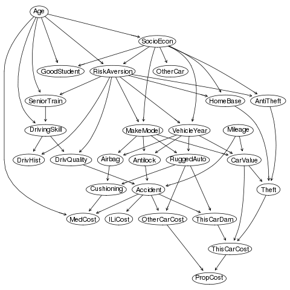

```{r setup, include=FALSE}
knitr::opts_chunk$set(echo = TRUE)
```

# Robustness analysis
The goal of this feature is to evaluate the effect of small variations in the sample used as input to the MIIC algorithm, so that we can measure its robustness to such events.

# Proposed solution
One way to do such analysis is by resampling the original sample $N$ (nSkeletons) times and inferring a skeleton for each of these resamples. Then, the idea is to create a _consensus skeleton_ based on all the inferred skeletons and compare it to the final network, inferred with the original sample. The _consensus skeleton_ is made of all edges that were present in at least $N\%$ (doConsensus) of the skeletons inferred from the resamplings

# Resampling methods
There are several resampling methods, as one can see in the figure below. For now, there are two methods implemented in MIIC: [Bootstraping](#bootstraping) and [jackknife](#jackknife).

```{r resampling_methods, echo=FALSE, fig.cap="Resampling with different methods. Taken from an [StackOverflow answer](https://stats.stackexchange.com/questions/104040/resampling-simulation-methods-monte-carlo-bootstrapping-jackknifing-cross). The networks above are [random](https://rpubs.com/lgadar/generate-graphs) and were used with the parameter for explanatory purposes.", out.width = '100%'}
knitr::include_graphics("figs/resampling methods.jpg")
```

## Bootstraping {#bootstraping}
Bootstraping generally refers to any resampling method that does resamples with replacement. This implies that some samples may not occur at all in the resample, while others may occurr more than once. The boostrap method for the consensus skeleton in MIIC works by taking $N$ (nSkeletons) resamplings with replacement.

## Jackknife {#jackknife}
Jackknife is a resampling method, without replacement, that does undersampling. One example would be to randomly choose 8 out of 10 samples, meaning a fraction of 80%. 

So far, jackknife has been chosen as the resampling method so the proposed solution goes as the following figure:

```{r workflow_consensus_network, echo=FALSE, fig.cap="Workflow to obtain the consensus network. Can be edited [here](https://www.draw.io/#G10BA0KiEFZl_YpKh6mIv2WlOP6cRgdyp0)", out.width = '100%'}
knitr::include_graphics("figs/workflow_consensus_network.png")
```

# Test dataset
Our proposed solution will be applied to binarized expression data of 33 transcription factors involved in early differentiation of primitive erythroid and endothelial cells (3934 cells). This dataset comes by default in the miic R package.

# Examples
In our example, let's use the _hematoData_ data package contained in the MIIC R package and build the consensus skeleton through 10 and 100 skeletons inferred from resamples.

## N=10
```{r}
library(miic)
data(hematoData)
nske = 10
```

### By bootstrapping
The consensus skeleton will be made of edges that are present in $80\%$ of the skeletons.
```{r eval=FALSE}
set.seed(2019)
miic.res = miic(inputData = hematoData, latent = TRUE, confidenceShuffle = 10,
                confidenceThreshold = 0.001,
                doConsensus = 80,
                nSkeletons = nske)
```

*Results*

```{r echo=TRUE, message=FALSE, eval=FALSE}
library(ggplot2)
library(dplyr)
as_tibble(miic.res$skeletons) %>%
  group_by(x, y) %>%
  summarise(count = n(), I = mean(as.numeric(I))) %>%
  ggplot(aes(x=count*100/nske, y=I)) + geom_point() + geom_jitter(height = 5) +
  geom_smooth() +
  labs(title="Edges in skeletons inferred from resamplings",
       x = "How often this edge was inferred in the skeletons",
       y = "Average Conditional Mutual Information for this edge")
```

```{r bs_fig1_10, echo=FALSE, out.width = '100%'}
knitr::include_graphics("figs/bootstrap_1_n10.png")
```

```{r echo=TRUE, message=FALSE, eval=FALSE}
library(ggplot2)
library(dplyr)
as_tibble(miic.res$skeletons) %>%
  group_by(x, y) %>%
  summarise(count = n(),
            ai_vect = mean(as.numeric(ai_vect_n)),
            I = mean(as.numeric(I))) %>%
  ggplot(aes(x=count*100/nske, y=ai_vect, color = log(I))) + geom_jitter(height = 0.01) + geom_point() +
  geom_smooth() +
  labs(title="Edges in skeletons inferred from resamplings",
       x = "How often this edge was inferred in the skeletons",
       y = "Number of nodes in the d-separation set",
       fill = "Log of average conditional mutual information")
``` 

```{r bs_fig2_10, echo=FALSE, out.width = '100%'}
knitr::include_graphics("figs/bootstrap_2_n100.png")
```

```{r eval=FALSE}
# Comparing final network to consensus skeleton
final_network <- as.data.frame(cbind(miic.res$retained.edges.summary$x,
                                     miic.res$retained.edges.summary$y))
colnames(final_network) <- colnames(miic.res$consensus_table) <- c('x', 'y')

# Proportion of final network which is not in the consensus table
n_edges_not_in_consensus <- nrow(dplyr::setdiff(final_network,
                                                miic.res$consensus_table))
n_total_final_network <- nrow(final_network)
prop_edges_not_in_consensus <- n_edges_not_in_consensus*100/n_total_final_network
prop_edges_in_consensus <- 100-prop_edges_not_in_consensus
paste0(prop_edges_in_consensus, '% of similarity')
```

[1] "65.3333333333333% of similarity"

### By jackknife
The consensus skeleton will be made of edges that are present in $80\%$ of the skeletons, and the resampling will be done randomly from $90\%$
of the original sample.
```{r eval=FALSE}
set.seed(2019)
miic.res = miic(inputData = hematoData, latent = TRUE, confidenceShuffle = 10,
                confidenceThreshold = 0.001,
                doConsensus = 80,
                nSkeletons = nske,
                proportionToUndersample = 90)
```

*Results*

```{r echo=TRUE, message=FALSE, eval=FALSE}
library(ggplot2)
library(dplyr)
as_tibble(miic.res$skeletons) %>%
  group_by(x, y) %>%
  summarise(count = n(), I = mean(as.numeric(I))) %>%
  ggplot(aes(x=count*100/nske, y=I)) + geom_point() + geom_jitter(height = 5) +
  geom_smooth() +
  labs(title="Edges in skeletons inferred from resamplings",
       x = "How often this edge was inferred in the skeletons",
       y = "Average Conditional Mutual Information for this edge")
```

```{r jk_fig1_10, echo=FALSE, out.width = '100%'}
knitr::include_graphics("figs/jackknife_1_n100.png")

```

```{r echo=TRUE, message=FALSE, eval=FALSE}
library(ggplot2)
library(dplyr)
as_tibble(miic.res$skeletons) %>%
  group_by(x, y) %>%
  summarise(count = n(),
            ai_vect = mean(as.numeric(ai_vect_n)),
            I = mean(as.numeric(I))) %>%
  ggplot(aes(x=count*100/nske, y=ai_vect, color = log(I))) + geom_jitter(height = 0.01) + geom_point() +
  geom_smooth() +
  labs(title="Edges in skeletons inferred from resamplings",
       x = "How often this edge was inferred in the skeletons",
       y = "Number of nodes in the d-separation set",
       fill = "Log of average conditional mutual information")
``` 

```{r jk_fig2_10, echo=FALSE, out.width = '100%'}
knitr::include_graphics("figs/jackknife_2_n100.png")
```

```{r eval=FALSE}
# Comparing final network to consensus skeleton
final_network <- as.data.frame(cbind(miic.res$retained.edges.summary$x,
                                     miic.res$retained.edges.summary$y))
colnames(final_network) <- colnames(miic.res$consensus_table) <- c('x', 'y')

# Proportion of final network which is not in the consensus table
n_edges_not_in_consensus <- nrow(dplyr::setdiff(final_network,
                                                miic.res$consensus_table))
n_total_final_network <- nrow(final_network)
prop_edges_not_in_consensus <- n_edges_not_in_consensus*100/n_total_final_network
prop_edges_in_consensus <- 100-prop_edges_not_in_consensus
paste0(prop_edges_in_consensus, '% of similarity')
```

[1] "86.6666666666667% of similarity"

## N=100
```{r}
library(miic)
data(hematoData)
nske = 100
```

### By bootstrapping
The consensus skeleton will be made of edges that are present in $80\%$ of the skeletons.
```{r eval=FALSE}
set.seed(2019)
miic.res = miic(inputData = hematoData, latent = TRUE, confidenceShuffle = 10,
                confidenceThreshold = 0.001,
                doConsensus = 80,
                nSkeletons = nske)
```

*Results*

```{r echo=TRUE, message=FALSE, eval=FALSE}
library(ggplot2)
library(dplyr)
as_tibble(miic.res$skeletons) %>%
  group_by(x, y) %>%
  summarise(count = n(), I = mean(as.numeric(I))) %>%
  ggplot(aes(x=count*100/nske, y=I)) + geom_point() + geom_jitter(height = 5) +
  geom_smooth() +
  labs(title="Edges in skeletons inferred from resamplings",
       x = "How often this edge was inferred in the skeletons",
       y = "Average Conditional Mutual Information for this edge")
```

```{r bs_fig1_100, echo=FALSE, out.width = '100%'}
knitr::include_graphics("figs/bootstrap_1_n100.png")
```

```{r echo=TRUE, message=FALSE, eval=FALSE}
library(ggplot2)
library(dplyr)
as_tibble(miic.res$skeletons) %>%
  group_by(x, y) %>%
  summarise(count = n(),
            ai_vect = mean(as.numeric(ai_vect_n)),
            I = mean(as.numeric(I))) %>%
  ggplot(aes(x=count*100/nske, y=ai_vect, color = log(I))) + geom_jitter(height = 0.01) + geom_point() +
  geom_smooth() +
  labs(title="Edges in skeletons inferred from resamplings",
       x = "How often this edge was inferred in the skeletons",
       y = "Number of nodes in the d-separation set",
       fill = "Log of average conditional mutual information")
``` 

```{r bs_fig2_100, echo=FALSE, out.width = '100%'}
knitr::include_graphics("figs/bootstrap_2_n100.png")
```

```{r eval=FALSE}
# Comparing final network to consensus skeleton
final_network <- as.data.frame(cbind(miic.res$retained.edges.summary$x,
                                     miic.res$retained.edges.summary$y))
colnames(final_network) <- colnames(miic.res$consensus_table) <- c('x', 'y')

# Proportion of final network which is not in the consensus table
n_edges_not_in_consensus <- nrow(dplyr::setdiff(final_network,
                                                miic.res$consensus_table))
n_total_final_network <- nrow(final_network)
prop_edges_not_in_consensus <- n_edges_not_in_consensus*100/n_total_final_network
prop_edges_in_consensus <- 100-prop_edges_not_in_consensus
paste0(prop_edges_in_consensus, '% of similarity')
```

[1] "60% of similarity"

### By jackknife
The consensus skeleton will be made of edges that are present in $80\%$ of the skeletons, and the resampling will be done randomly from $90\%$
of the original sample.
```{r eval=FALSE}
set.seed(2019)
miic.res = miic(inputData = hematoData, latent = TRUE, confidenceShuffle = 10,
                confidenceThreshold = 0.001,
                doConsensus = 80,
                nSkeletons = nske,
                proportionToUndersample = 90)
```

*Results*

```{r echo=TRUE, message=FALSE, eval=FALSE}
library(ggplot2)
library(dplyr)
as_tibble(miic.res$skeletons) %>%
  group_by(x, y) %>%
  summarise(count = n(), I = mean(as.numeric(I))) %>%
  ggplot(aes(x=count*100/nske, y=I)) + geom_point() + geom_jitter(height = 5) +
  geom_smooth() +
  labs(title="Edges in skeletons inferred from resamplings",
       x = "How often this edge was inferred in the skeletons",
       y = "Average Conditional Mutual Information for this edge")
```

```{r jk_fig1_100, echo=FALSE, out.width = '100%'}
knitr::include_graphics("figs/jackknife_1_n100.png")
```

```{r echo=TRUE, message=FALSE, eval=FALSE}
library(ggplot2)
library(dplyr)
as_tibble(miic.res$skeletons) %>%
  group_by(x, y) %>%
  summarise(count = n(),
            ai_vect = mean(as.numeric(ai_vect_n)),
            I = mean(as.numeric(I))) %>%
  ggplot(aes(x=count*100/nske, y=ai_vect, color = log(I))) + geom_jitter(height = 0.01) + geom_point() +
  geom_smooth() +
  labs(title="Edges in skeletons inferred from resamplings",
       x = "How often this edge was inferred in the skeletons",
       y = "Number of nodes in the d-separation set",
       fill = "Log of average conditional mutual information")
``` 

```{r jk_fig2_100, echo=FALSE, out.width = '100%'}
knitr::include_graphics("figs/jackknife_2_n100.png")
```

```{r eval=FALSE}
# Comparing final network to consensus skeleton
final_network <- as.data.frame(cbind(miic.res$retained.edges.summary$x,
                                     miic.res$retained.edges.summary$y))
colnames(final_network) <- colnames(miic.res$consensus_table) <- c('x', 'y')

# Proportion of final network which is not in the consensus table
n_edges_not_in_consensus <- nrow(dplyr::setdiff(final_network,
                                                miic.res$consensus_table))
n_total_final_network <- nrow(final_network)
prop_edges_not_in_consensus <- n_edges_not_in_consensus*100/n_total_final_network
prop_edges_in_consensus <- 100-prop_edges_not_in_consensus
paste0(prop_edges_in_consensus, '% of similarity')
```

[1] "82.6666666666667% of similarity"

# Evaluating parameters
The idea is to evaluate the parameters used for the resampling approach. These parameters are the number of skeletons to build the consensus skeleton, the minimum occurrence of an edge in these skeletons to be included in the consensus skeleton and the proportion of the original data to be randomly undersampled to be given as input for each skeleton.

There is no point in having very small steps, such as consensus from 1 to 100, one by one. The differences, keeping other parameters still, would be very small to realize. Mostly noise. Besides, the amount of time to run these three loops would take a hueg amount of time. This way, I decided to have larger steps.

## Jackknife
I initially tried to do everything in RStudio but at every iteration the amount of RAM was growing absurdly, even if not keeping any data from the previous iteration (except counters, that is, i,j and k). A solution for that was to write an R script and a shell script that would call the former iteratively.

### With edge filtering
The R script code is shown below:

```{r eval=FALSE}
library(dplyr)
library(ggplot2)
library(optparse)
library(miic)

# Running robustness evaluation algorithm per se
robustness_evaluation <- function(nSkeletons, consensus, fraction,
                                  seed=2019) {
  setwd('/home/mribeirodantas/dev/miic_r_package/tmp/figs/loops/edge_filtering_both')
  set.seed(seed)
  # Running MIIC
  miic.res = miic(inputData = hematoData, latent = TRUE, confidenceShuffle = 10,
                  confidenceThreshold = 0.001,
                  doConsensus = consensus,
                  nSkeletons = nSkeletons,
                  proportionToUndersample = fraction)
  # Plotting average CI by edge
  as_tibble(miic.res$skeletons) %>%
    group_by(x, y) %>%
    summarise(count = n(), I = mean(as.numeric(I))) %>%
    ggplot(aes(x=count*100/nSkeletons, y=I)) + geom_point() + geom_jitter(height = 5) +
    geom_smooth() +
    labs(title="Edges in skeletons inferred from resamplings",
         x = "How often this edge was inferred in the skeletons",
         y = "Average Conditional Mutual Information for this edge")
  ggsave(paste("CI", consensus, nSkeletons, fraction, ".jpg", sep = ' '))
  # Plotting number of nodes in d-separation set
  as_tibble(miic.res$skeletons) %>%
    group_by(x, y) %>%
    summarise(count = n(),
              ai_vect = mean(as.numeric(ai_vect_n)),
              I = mean(as.numeric(I))) %>%
    ggplot(aes(x=count*100/nSkeletons, y=ai_vect, color = log(I))) + geom_jitter(height = 0.01) + geom_point() +
    geom_smooth() +
    labs(title="Edges in skeletons inferred from resamplings",
         x = "How often this edge was inferred in the skeletons",
         y = "Number of nodes in the d-separation set",
         fill = "Log of average conditional mutual information")
  ggsave(paste("d-sep", consensus, nSkeletons, fraction, ".jpg", sep = ' '))
  # Proportion of similarity
  final_network <- as.data.frame(cbind(miic.res$retained.edges.summary$x,
                                       miic.res$retained.edges.summary$y))
  colnames(final_network) <- colnames(miic.res$consensus_table) <- c('x', 'y')
  # Proportion of final network which is not in the consensus table
  n_edges_not_in_consensus <- nrow(dplyr::setdiff(final_network,
                                                  miic.res$consensus_table))
  n_total_final_network <- nrow(final_network)
  prop_edges_not_in_consensus <- n_edges_not_in_consensus*100/n_total_final_network
  prop_edges_in_consensus <- 100-prop_edges_not_in_consensus
  write(paste0(prop_edges_in_consensus, ',',
               consensus, ',',
               nSkeletons, ',',
               fraction),
        file="percent_similarity.txt",append=TRUE)
}

# Handling arguments
option_list = list(
  make_option(c("-n", "--nSkeletons"), type="integer", default=10,
              help=paste("number of skeletons inferred for consensus skeleton",
                         "[default= %default]."),
              metavar="integer"),
  make_option(c("-c", "--consensus"), type="integer", default=80,
              help=paste("frequency of occurrence for adding edge to consensus",
              "network [default= %default]."),
              metavar="integer"),
  make_option(c("-f", "--fraction"), type="integer", default=90,
              help=paste("fraction that will be randomly sampled from original",
              "data [default= %default]."),
              metavar="integer"),
  make_option(c("-s", "--seed"), type="integer", default=2019,
              help="seed for reproduction of results [default= %default].",
              metavar="integer"),
  make_option(c("-d", "--destinationPath"),
              help="output destination [default= %default].",
              metavar="string")
);

opt_parser = OptionParser(option_list=option_list);
opt = parse_args(opt_parser);

# Calling code with handled arguments
robustness_evaluation(nSkeletons = opt$nSkeletons,
                      consensus = opt$consensus,
                      fraction = opt$fraction,
                      seed = opt$seed)
```

The code above, within an R script file, is called by the shell script below:

```{r eval=FALSE}
#!/usr/bin/sh

#!/bin/sh
for i in `seq 50 10 100`
do
  for j in `seq 10 10 100`
  do
    for k in `seq 80 5 95`
    do
      Rscript robustness_evaluation.R -n $j -c $i -f $k -s 2019 -d "/home/mribeirodantas/dev/miic_r_package/tmp/figs/loops"
    done
  done
done
```

With both files in the same file directory, the following command line should be run:

```{r eval=FALSE}
./call_robustness_evaluation.sh
```

#### Analysis of results

One way of visualize the result is through a scatter plot, where every dot is a simulation in a 3D-plot where X=nSkeletons, Y=Consensus and Z=Fraction. The edge will also be colored according to the accuracy between the consensus skeleton and the final skeleton.

The code below is only run in RStudio.
```{r eval=FALSE}
library(dplyr)
library(plot3Drgl)

setwd('tmp/figs/loops/')
df <- as_tibble(read.csv2(file = 'percent_similarity.txt', sep = ',',
                          header = FALSE, stringsAsFactors = FALSE))
colnames(df) <- c('accuracy', 'consensus', 'nskeleton', 'fraction')
df$accuracy <- as.numeric(df$accuracy)

library(plot3D)

scatter3D(x = df$nskeleton, z = df$consensus, y = df$fraction,
          colvar = df$accuracy, clab = c("Accuracy"), pch = 19,
          ticktype = "detailed",
          bty = "b2", phi = 0, ylim=c(1,100), zlim=c(1,100),
          xlim=c(1,100), zlab = c('% Consensus'), ylab = c('% fraction used'),
          xlab = c('nSkeletons')
          ) # try also without specifying phi
# 3d interactive plot locally
plotrgl()
```

```{r output_local_3D_wo_ef, echo=FALSE, fig.cap="3D plot of the simulation", out.width = '100%'}
knitr::include_graphics("/home/mribeirodantas/dev/miic_r_package/tmp/figs/3D_output_default_w_ef.png")
```

This code produces the 3D interactive plot in this report.
```{r, message=FALSE}
library(threejs)
library(dplyr)

setwd('/home/mribeirodantas/dev/miic_r_package/tmp/figs/loops/wo_edge_filtering')
df <- as_tibble(read.csv2(file = 'percent_similarity.txt', sep = ',',
                          header = FALSE, stringsAsFactors = FALSE))
colnames(df) <- c('accuracy', 'consensus', 'nskeleton', 'fraction')
df$accuracy <- as.numeric(df$accuracy)

scatterplot3js(x = df$nskeleton, z = df$consensus, y = df$fraction,
               color = rainbow(length(df$accuracy)), main=paste("Hover mouse",
               " over dots to check accuraccy"),
               labels=as.character(df$accuracy),
               xlim=c(10,100),
               ylim=c(10,100),
               zlim=c(10,100),
               size=0.5)
```

How much does accuracy vary through these parameters?
```{r eval=FALSE}
library(dplyr)

nskeletons_min <- df %>%
  filter(nskeleton == min(df$nskeleton)) %>%
  summarise(min = min(accuracy), max = max(accuracy))
nskeletons_max <- df %>%
  filter(nskeleton == max(df$nskeleton)) %>%
  summarise(min = min(accuracy), max = max(accuracy))
diff <- nskeletons_max - nskeletons_min
colnames(diff) <- c('diff in min (nskeletons)', 'diff in max (nskeletons)')
abs(diff)

fraction_min <- df %>%
  filter(fraction == min(df$fraction)) %>%
  summarise(min = min(accuracy), max = max(accuracy))
fraction_max <- df %>%
  filter(fraction == max(df$fraction)) %>%
  summarise(min = min(accuracy), max = max(accuracy))
diff <- fraction_max - fraction_min
colnames(diff) <- c('diff in min (fraction)', 'diff in max (fraction)')
abs(diff)

consensus_min <- df %>%
  filter(consensus == min(df$consensus)) %>%
  summarise(min = min(accuracy), max = max(accuracy))
consensus_max <- df %>%
  filter(consensus == max(df$consensus)) %>%
  summarise(min = min(accuracy), max = max(accuracy))
diff <- consensus_max - consensus_min
colnames(diff) <- c('diff in min (consensus)', 'diff in max (consensus)')
abs(diff)

```

```{r echo=FALSE, eval=TRUE}
library(dplyr)

df <- matrix(c(10.666667, 0), ncol = 2, nrow = 1)
colnames(df) <- c('diff in min (nskeletons)', 'diff in max (nskeletons)')
as.data.frame(df)

df <- matrix(c(22.66667, 1.333333), ncol = 2, nrow = 1)
colnames(df) <- c('diff in min (fraction)', 'diff in max (fraction)')
as.data.frame(df)

df <- matrix(c(45.333333, 21.333333), ncol = 2, nrow = 1)
colnames(df) <- c('diff in min (consensus)', 'diff in max (consensus)')
as.data.frame(df)
```

### Without edge filtering
The R script code is shown below:

```{r eval=FALSE}
library(dplyr)
library(ggplot2)
library(optparse)
library(miic)

# Running robustness evaluation algorithm per se
robustness_evaluation <- function(nSkeletons, consensus, fraction,
                                  seed=2019) {
  setwd('/home/mribeirodantas/dev/miic_r_package/tmp/figs/loops/wo_edge_filtering')
  set.seed(seed)
  # Running MIIC
  miic.res = miic(inputData = hematoData, latent = TRUE,
                  doConsensus = consensus,
                  nSkeletons = nSkeletons,
                  proportionToUndersample = fraction)
  # Plotting average CI by edge
  as_tibble(miic.res$skeletons) %>%
    group_by(x, y) %>%
    summarise(count = n(), I = mean(as.numeric(I))) %>%
    ggplot(aes(x=count*100/nSkeletons, y=I)) + geom_point() + geom_jitter(height = 5) +
    geom_smooth() +
    labs(title="Edges in skeletons inferred from resamplings",
         x = "How often this edge was inferred in the skeletons",
         y = "Average Conditional Mutual Information for this edge")
  ggsave(paste("CI", consensus, nSkeletons, fraction, ".jpg", sep = ' '))
  # Plotting number of nodes in d-separation set
  as_tibble(miic.res$skeletons) %>%
    group_by(x, y) %>%
    summarise(count = n(),
              ai_vect = mean(as.numeric(ai_vect_n)),
              I = mean(as.numeric(I))) %>%
    ggplot(aes(x=count*100/nSkeletons, y=ai_vect, color = log(I))) + geom_jitter(height = 0.01) + geom_point() +
    geom_smooth() +
    labs(title="Edges in skeletons inferred from resamplings",
         x = "How often this edge was inferred in the skeletons",
         y = "Number of nodes in the d-separation set",
         fill = "Log of average conditional mutual information")
  ggsave(paste("d-sep", consensus, nSkeletons, fraction, ".jpg", sep = ' '))
  # Proportion of similarity
  final_network <- as.data.frame(cbind(miic.res$retained.edges.summary$x,
                                       miic.res$retained.edges.summary$y))
  colnames(final_network) <- colnames(miic.res$consensus_table) <- c('x', 'y')
  # Proportion of final network which is not in the consensus table
  n_edges_not_in_consensus <- nrow(dplyr::setdiff(final_network,
                                                  miic.res$consensus_table))
  n_total_final_network <- nrow(final_network)
  prop_edges_not_in_consensus <- n_edges_not_in_consensus*100/n_total_final_network
  prop_edges_in_consensus <- 100-prop_edges_not_in_consensus
  write(paste0(prop_edges_in_consensus, ',',
               consensus, ',',
               nSkeletons, ',',
               fraction),
        file="percent_similarity.txt",append=TRUE)
}

# Handling arguments
option_list = list(
  make_option(c("-n", "--nSkeletons"), type="integer", default=10,
              help=paste("number of skeletons inferred for consensus skeleton",
                         "[default= %default]."),
              metavar="integer"),
  make_option(c("-c", "--consensus"), type="integer", default=80,
              help=paste("frequency of occurrence for adding edge to consensus",
              "network [default= %default]."),
              metavar="integer"),
  make_option(c("-f", "--fraction"), type="integer", default=90,
              help=paste("fraction that will be randomly sampled from original",
              "data [default= %default]."),
              metavar="integer"),
  make_option(c("-s", "--seed"), type="integer", default=2019,
              help="seed for reproduction of results [default= %default].",
              metavar="integer"),
  make_option(c("-d", "--destinationPath"),
              help="output destination [default= %default].",
              metavar="string")
);

opt_parser = OptionParser(option_list=option_list);
opt = parse_args(opt_parser);

# Calling code with handled arguments
robustness_evaluation(nSkeletons = opt$nSkeletons,
                      consensus = opt$consensus,
                      fraction = opt$fraction,
                      seed = opt$seed)
```

The code above, within an R script file, is called by the shell script below:

```{r eval=FALSE}
#!/usr/bin/sh

#!/bin/sh
for i in `seq 50 10 100`
do
  for j in `seq 10 10 100`
  do
    for k in `seq 80 5 95`
    do
      Rscript robustness_evaluation.R -n $j -c $i -f $k -s 2019 -d "/home/mribeirodantas/dev/miic_r_package/tmp/figs/loops/wo_edge_filtering"
    done
  done
done
```

With both files in the same file directory, the following command line should be run:

```{r eval=FALSE}
./call_robustness_evaluation.sh
```

#### Analysis of results

One way of visualize the result is through a scatter plot, where every dot is a simulation in a 3D-plot where X=nSkeletons, Y=Consensus and Z=Fraction. The edge will also be colored according to the accuracy between the consensus skeleton and the final skeleton.

The code below is only run in RStudio.
```{r eval=FALSE}
library(dplyr)
library(plot3Drgl)

setwd('tmp/figs/loops/wo_edge_filtering/')
df <- as_tibble(read.csv2(file = 'percent_similarity.txt', sep = ',',
                          header = FALSE, stringsAsFactors = FALSE))
colnames(df) <- c('accuracy', 'consensus', 'nskeleton', 'fraction')
df$accuracy <- as.numeric(df$accuracy)

library(plot3D)

scatter3D(x = df$nskeleton, z = df$consensus, y = df$fraction,
          colvar = df$accuracy, clab = c("Accuracy"), pch = 19,
          ticktype = "detailed",
          bty = "b2", phi = 0, ylim=c(1,100), zlim=c(1,100),
          xlim=c(1,100), zlab = c('% Consensus'), ylab = c('% fraction used'),
          xlab = c('nSkeletons')
          ) # try also without specifying phi
# 3d interactive plot locally
plotrgl()
```

```{r output_local_3D, echo=FALSE, fig.cap="3D plot of the simulation", out.width = '100%'}
knitr::include_graphics("/home/mribeirodantas/dev/miic_r_package/tmp/figs/3D_output_default_w_ef.png")
```

This code produces the 3D interactive plot in this report.
```{r, message=FALSE}
library(threejs)
library(dplyr)

setwd('/home/mribeirodantas/dev/miic_r_package/tmp/figs/loops/wo_edge_filtering/')
df <- as_tibble(read.csv2(file = 'percent_similarity.txt', sep = ',',
                          header = FALSE, stringsAsFactors = FALSE))
colnames(df) <- c('accuracy', 'consensus', 'nskeleton', 'fraction')
df$accuracy <- as.numeric(df$accuracy)

scatterplot3js(x = df$nskeleton, z = df$consensus, y = df$fraction,
               color = rainbow(length(df$accuracy)), main=paste("Hover mouse",
               " over dots to check accuraccy"),
               labels=as.character(df$accuracy),
               xlim=c(10,100),
               ylim=c(10,100),
               zlim=c(10,100),
               size=0.5)
```

How much does accuracy vary through these parameters?
```{r eval=FALSE}
library(dplyr)

nskeletons_min <- df %>%
  filter(nskeleton == min(df$nskeleton)) %>%
  summarise(min = min(accuracy), max = max(accuracy))
nskeletons_max <- df %>%
  filter(nskeleton == max(df$nskeleton)) %>%
  summarise(min = min(accuracy), max = max(accuracy))
diff <- nskeletons_max - nskeletons_min
colnames(diff) <- c('diff in min (nskeletons)', 'diff in max (nskeletons)')
abs(diff)

fraction_min <- df %>%
  filter(fraction == min(df$fraction)) %>%
  summarise(min = min(accuracy), max = max(accuracy))
fraction_max <- df %>%
  filter(fraction == max(df$fraction)) %>%
  summarise(min = min(accuracy), max = max(accuracy))
diff <- fraction_max - fraction_min
colnames(diff) <- c('diff in min (fraction)', 'diff in max (fraction)')
abs(diff)

consensus_min <- df %>%
  filter(consensus == min(df$consensus)) %>%
  summarise(min = min(accuracy), max = max(accuracy))
consensus_max <- df %>%
  filter(consensus == max(df$consensus)) %>%
  summarise(min = min(accuracy), max = max(accuracy))
diff <- consensus_max - consensus_min
colnames(diff) <- c('diff in min (consensus)', 'diff in max (consensus)')
abs(diff)

```

```{r echo=FALSE, eval=TRUE}
library(dplyr)

df <- matrix(c(15.85366, 0), ncol = 2, nrow = 1)
colnames(df) <- c('diff in min (nskeletons)', 'diff in max (nskeletons)')
as.data.frame(df)

df <- matrix(c(23.17073, 4.878049), ncol = 2, nrow = 1)
colnames(df) <- c('diff in min (fraction)', 'diff in max (fraction)')
as.data.frame(df)

df <- matrix(c(45.12195, 20.73171), ncol = 2, nrow = 1)
colnames(df) <- c('diff in min (consensus)', 'diff in max (consensus)')
as.data.frame(df)
```

### Edge filtering only for skeleton from full dataset
The R script code is shown below:

```{r eval=FALSE}
library(dplyr)
library(ggplot2)
library(optparse)
library(miic)

# Running robustness evaluation algorithm per se
robustness_evaluation <- function(nSkeletons, consensus, fraction,
                                  seed=2019) {
  setwd('/home/mribeirodantas/dev/miic_r_package/tmp/figs/loops/edge_filtering_only_fulldataset/')
  set.seed(seed)
  # Running MIIC
  miic.res = miic(inputData = hematoData, latent = TRUE,
                  doConsensus = consensus,
                  nSkeletons = nSkeletons,
                  proportionToUndersample = fraction)
  # Plotting average CI by edge
  as_tibble(miic.res$skeletons) %>%
    group_by(x, y) %>%
    summarise(count = n(), I = mean(as.numeric(I))) %>%
    ggplot(aes(x=count*100/nSkeletons, y=I)) + geom_point() + geom_jitter(height = 5) +
    geom_smooth() +
    labs(title="Edges in skeletons inferred from resamplings",
         x = "How often this edge was inferred in the skeletons",
         y = "Average Conditional Mutual Information for this edge")
  ggsave(paste("CI", consensus, nSkeletons, fraction, ".jpg", sep = ' '))
  # Plotting number of nodes in d-separation set
  as_tibble(miic.res$skeletons) %>%
    group_by(x, y) %>%
    summarise(count = n(),
              ai_vect = mean(as.numeric(ai_vect_n)),
              I = mean(as.numeric(I))) %>%
    ggplot(aes(x=count*100/nSkeletons, y=ai_vect, color = log(I))) + geom_jitter(height = 0.01) + geom_point() +
    geom_smooth() +
    labs(title="Edges in skeletons inferred from resamplings",
         x = "How often this edge was inferred in the skeletons",
         y = "Number of nodes in the d-separation set",
         fill = "Log of average conditional mutual information")
  ggsave(paste("d-sep", consensus, nSkeletons, fraction, ".jpg", sep = ' '))
  # Proportion of similarity
  final_network <- as.data.frame(cbind(miic.res$retained.edges.summary$x,
                                       miic.res$retained.edges.summary$y))
  colnames(final_network) <- colnames(miic.res$consensus_table) <- c('x', 'y')
  # Proportion of final network which is not in the consensus table
  n_edges_not_in_consensus <- nrow(dplyr::setdiff(final_network,
                                                  miic.res$consensus_table))
  n_total_final_network <- nrow(final_network)
  prop_edges_not_in_consensus <- n_edges_not_in_consensus*100/n_total_final_network
  prop_edges_in_consensus <- 100-prop_edges_not_in_consensus
  write(paste0(prop_edges_in_consensus, ',',
               consensus, ',',
               nSkeletons, ',',
               fraction),
        file="percent_similarity.txt",append=TRUE)
}

# Handling arguments
option_list = list(
  make_option(c("-n", "--nSkeletons"), type="integer", default=10,
              help=paste("number of skeletons inferred for consensus skeleton",
                         "[default= %default]."),
              metavar="integer"),
  make_option(c("-c", "--consensus"), type="integer", default=80,
              help=paste("frequency of occurrence for adding edge to consensus",
              "network [default= %default]."),
              metavar="integer"),
  make_option(c("-f", "--fraction"), type="integer", default=90,
              help=paste("fraction that will be randomly sampled from original",
              "data [default= %default]."),
              metavar="integer"),
  make_option(c("-s", "--seed"), type="integer", default=2019,
              help="seed for reproduction of results [default= %default].",
              metavar="integer"),
  make_option(c("-d", "--destinationPath"),
              help="output destination [default= %default].",
              metavar="string")
);

opt_parser = OptionParser(option_list=option_list);
opt = parse_args(opt_parser);

# Calling code with handled arguments
robustness_evaluation(nSkeletons = opt$nSkeletons,
                      consensus = opt$consensus,
                      fraction = opt$fraction,
                      seed = opt$seed)
```

The code above, within an R script file, is called by the shell script below:

```{r eval=FALSE}
#!/usr/bin/sh

#!/bin/sh
for i in `seq 50 10 100`
do
  for j in `seq 10 10 100`
  do
    for k in `seq 80 5 95`
    do
      Rscript robustness_evaluation.R -n $j -c $i -f $k -s 2019 -d "/home/mribeirodantas/dev/miic_r_package/tmp/figs/loops/edge_filtering_only_fulldataset/"
    done
  done
done
```

With both files in the same file directory, the following command line should be run:

```{r eval=FALSE}
./call_robustness_evaluation.sh
```

#### Analysis of results

One way of visualize the result is through a scatter plot, where every dot is a simulation in a 3D-plot where X=nSkeletons, Y=Consensus and Z=Fraction. The edge will also be colored according to the accuracy between the consensus skeleton and the final skeleton.

The code below is only run in RStudio.
```{r eval=FALSE}
library(dplyr)
library(plot3Drgl)

setwd('tmp/figs/loops/edge_filtering_only_fulldataset/')
df <- as_tibble(read.csv2(file = 'percent_similarity.txt', sep = ',',
                          header = FALSE, stringsAsFactors = FALSE))
colnames(df) <- c('accuracy', 'consensus', 'nskeleton', 'fraction')
df$accuracy <- as.numeric(df$accuracy)

library(plot3D)

scatter3D(x = df$nskeleton, z = df$consensus, y = df$fraction,
          colvar = df$accuracy, clab = c("Accuracy"), pch = 19,
          ticktype = "detailed",
          bty = "b2", phi = 0, ylim=c(1,100), zlim=c(1,100),
          xlim=c(1,100), zlab = c('% Consensus'), ylab = c('% fraction used'),
          xlab = c('nSkeletons')
          ) # try also without specifying phi
# 3d interactive plot locally
plotrgl()
```

*Pending resimulation*

```{r output_local_3D_ef_fds, echo=FALSE, eval=FALSE, fig.cap="3D plot of the simulation", out.width = '100%'}
knitr::include_graphics("/home/mribeirodantas/dev/miic_r_package/tmp/figs/3D_output_default_w_ef_fds.png")
```

This code produces the 3D interactive plot in this report.

*Pending resimulation*

```{r, eval=FALSE, message=FALSE}
library(threejs)
library(dplyr)

setwd('/home/mribeirodantas/dev/miic_r_package/tmp/figs/loops/edge_filtering_only_fulldataset/')
df <- as_tibble(read.csv2(file = 'percent_similarity.txt', sep = ',',
                          header = FALSE, stringsAsFactors = FALSE))
colnames(df) <- c('accuracy', 'consensus', 'nskeleton', 'fraction')
df$accuracy <- as.numeric(df$accuracy)

scatterplot3js(x = df$nskeleton, z = df$consensus, y = df$fraction,
               color = rainbow(length(df$accuracy)), main=paste("Hover mouse",
               " over dots to check accuraccy"),
               labels=as.character(df$accuracy),
               xlim=c(10,100),
               ylim=c(10,100),
               zlim=c(10,100),
               size=0.5)
```

How much does accuracy vary through these parameters?
```{r eval=FALSE}
library(dplyr)

nskeletons_min <- df %>%
  filter(nskeleton == min(df$nskeleton)) %>%
  summarise(min = min(accuracy), max = max(accuracy))
nskeletons_max <- df %>%
  filter(nskeleton == max(df$nskeleton)) %>%
  summarise(min = min(accuracy), max = max(accuracy))
diff <- nskeletons_max - nskeletons_min
colnames(diff) <- c('diff in min (nskeletons)', 'diff in max (nskeletons)')
abs(diff)

fraction_min <- df %>%
  filter(fraction == min(df$fraction)) %>%
  summarise(min = min(accuracy), max = max(accuracy))
fraction_max <- df %>%
  filter(fraction == max(df$fraction)) %>%
  summarise(min = min(accuracy), max = max(accuracy))
diff <- fraction_max - fraction_min
colnames(diff) <- c('diff in min (fraction)', 'diff in max (fraction)')
abs(diff)

consensus_min <- df %>%
  filter(consensus == min(df$consensus)) %>%
  summarise(min = min(accuracy), max = max(accuracy))
consensus_max <- df %>%
  filter(consensus == max(df$consensus)) %>%
  summarise(min = min(accuracy), max = max(accuracy))
diff <- consensus_max - consensus_min
colnames(diff) <- c('diff in min (consensus)', 'diff in max (consensus)')
abs(diff)

```

```{r echo=FALSE, eval=TRUE}
library(dplyr)

df <- matrix(c(16, 0), ncol = 2, nrow = 1)
colnames(df) <- c('diff in min (nskeletons)', 'diff in max (nskeletons)')
as.data.frame(df)

df <- matrix(c(26.66667, 0), ncol = 2, nrow = 1)
colnames(df) <- c('diff in min (fraction)', 'diff in max (fraction)')
as.data.frame(df)

df <- matrix(c(48, 10.66667), ncol = 2, nrow = 1)
colnames(df) <- c('diff in min (consensus)', 'diff in max (consensus)')
as.data.frame(df)
```

### Edge filtering only for skeletons from resampled dataset
The R script code is shown below:

```{r eval=FALSE}
library(dplyr)
library(ggplot2)
library(optparse)
library(miic)

# Running robustness evaluation algorithm per se
robustness_evaluation <- function(nSkeletons, consensus, fraction,
                                  seed=2019) {
  setwd('/home/mribeirodantas/dev/miic_r_package/tmp/figs/loops/only_resamplings/')
  set.seed(seed)
  # Running MIIC
  miic.res = miic(inputData = hematoData, latent = TRUE,
                  doConsensus = consensus,
                  nSkeletons = nSkeletons,
                  proportionToUndersample = fraction)
  # Plotting average CI by edge
  as_tibble(miic.res$skeletons) %>%
    group_by(x, y) %>%
    summarise(count = n(), I = mean(as.numeric(I))) %>%
    ggplot(aes(x=count*100/nSkeletons, y=I)) + geom_point() + geom_jitter(height = 5) +
    geom_smooth() +
    labs(title="Edges in skeletons inferred from resamplings",
         x = "How often this edge was inferred in the skeletons",
         y = "Average Conditional Mutual Information for this edge")
  ggsave(paste("CI", consensus, nSkeletons, fraction, ".jpg", sep = ' '))
  # Plotting number of nodes in d-separation set
  as_tibble(miic.res$skeletons) %>%
    group_by(x, y) %>%
    summarise(count = n(),
              ai_vect = mean(as.numeric(ai_vect_n)),
              I = mean(as.numeric(I))) %>%
    ggplot(aes(x=count*100/nSkeletons, y=ai_vect, color = log(I))) + geom_jitter(height = 0.01) + geom_point() +
    geom_smooth() +
    labs(title="Edges in skeletons inferred from resamplings",
         x = "How often this edge was inferred in the skeletons",
         y = "Number of nodes in the d-separation set",
         fill = "Log of average conditional mutual information")
  ggsave(paste("d-sep", consensus, nSkeletons, fraction, ".jpg", sep = ' '))
  # Proportion of similarity
  final_network <- as.data.frame(cbind(miic.res$retained.edges.summary$x,
                                       miic.res$retained.edges.summary$y))
  colnames(final_network) <- colnames(miic.res$consensus_table) <- c('x', 'y')
  # Proportion of final network which is not in the consensus table
  n_edges_not_in_consensus <- nrow(dplyr::setdiff(final_network,
                                                  miic.res$consensus_table))
  n_total_final_network <- nrow(final_network)
  prop_edges_not_in_consensus <- n_edges_not_in_consensus*100/n_total_final_network
  prop_edges_in_consensus <- 100-prop_edges_not_in_consensus
  write(paste0(prop_edges_in_consensus, ',',
               consensus, ',',
               nSkeletons, ',',
               fraction),
        file="percent_similarity.txt",append=TRUE)
}

# Handling arguments
option_list = list(
  make_option(c("-n", "--nSkeletons"), type="integer", default=10,
              help=paste("number of skeletons inferred for consensus skeleton",
                         "[default= %default]."),
              metavar="integer"),
  make_option(c("-c", "--consensus"), type="integer", default=80,
              help=paste("frequency of occurrence for adding edge to consensus",
              "network [default= %default]."),
              metavar="integer"),
  make_option(c("-f", "--fraction"), type="integer", default=90,
              help=paste("fraction that will be randomly sampled from original",
              "data [default= %default]."),
              metavar="integer"),
  make_option(c("-s", "--seed"), type="integer", default=2019,
              help="seed for reproduction of results [default= %default].",
              metavar="integer"),
  make_option(c("-d", "--destinationPath"),
              help="output destination [default= %default].",
              metavar="string")
);

opt_parser = OptionParser(option_list=option_list);
opt = parse_args(opt_parser);

# Calling code with handled arguments
robustness_evaluation(nSkeletons = opt$nSkeletons,
                      consensus = opt$consensus,
                      fraction = opt$fraction,
                      seed = opt$seed)
```

The code above, within an R script file, is called by the shell script below:

```{r eval=FALSE}
#!/usr/bin/sh

#!/bin/sh
for i in `seq 50 10 100`
do
  for j in `seq 10 10 100`
  do
    for k in `seq 80 5 95`
    do
      Rscript robustness_evaluation.R -n $j -c $i -f $k -s 2019 -d "/home/mribeirodantas/dev/miic_r_package/tmp/figs/loops/only_resamplings"
    done
  done
done
```

With both files in the same file directory, the following command line should be run:

```{r eval=FALSE}
./call_robustness_evaluation.sh
```

#### Analysis of results

One way of visualize the result is through a scatter plot, where every dot is a simulation in a 3D-plot where X=nSkeletons, Y=Consensus and Z=Fraction. The edge will also be colored according to the accuracy between the consensus skeleton and the final skeleton.

The code below is only run in RStudio.
```{r eval=FALSE}
library(dplyr)
library(plot3Drgl)

setwd('/home/mribeirodantas/dev/miic_r_package/tmp/figs/loops/only_resamplings/')
df <- as_tibble(read.csv2(file = 'percent_similarity.txt', sep = ',',
                          header = FALSE, stringsAsFactors = FALSE))
colnames(df) <- c('accuracy', 'consensus', 'nskeleton', 'fraction')
df$accuracy <- as.numeric(df$accuracy)

library(plot3D)

scatter3D(x = df$nskeleton, z = df$consensus, y = df$fraction,
          colvar = df$accuracy, clab = c("Accuracy"), pch = 19,
          ticktype = "detailed",
          bty = "b2", phi = 0, ylim=c(1,100), zlim=c(1,100),
          xlim=c(1,100), zlab = c('% Consensus'), ylab = c('% fraction used'),
          xlab = c('nSkeletons')
          ) # try also without specifying phi
# 3d interactive plot locally
plotrgl()
```

```{r output_local_3D_ef_rds, echo=FALSE, fig.cap="3D plot of the simulation", out.width = '100%'}
knitr::include_graphics("/home/mribeirodantas/dev/miic_r_package/tmp/figs/3D_output_default_w_ef_rds.png")
```

This code produces the 3D interactive plot in this report.
```{r, message=FALSE}
library(threejs)
library(dplyr)

setwd('/home/mribeirodantas/dev/miic_r_package/tmp/figs/loops/wo_edge_filtering/')
df <- as_tibble(read.csv2(file = 'percent_similarity.txt', sep = ',',
                          header = FALSE, stringsAsFactors = FALSE))
colnames(df) <- c('accuracy', 'consensus', 'nskeleton', 'fraction')
df$accuracy <- as.numeric(df$accuracy)

scatterplot3js(x = df$nskeleton, z = df$consensus, y = df$fraction,
               color = rainbow(length(df$accuracy)), main=paste("Hover mouse",
               " over dots to check accuraccy"),
               labels=as.character(df$accuracy),
               xlim=c(10,100),
               ylim=c(10,100),
               zlim=c(10,100),
               size=0.5)
```

How much does accuracy vary through these parameters?
```{r eval=FALSE}
library(dplyr)

nskeletons_min <- df %>%
  filter(nskeleton == min(df$nskeleton)) %>%
  summarise(min = min(accuracy), max = max(accuracy))
nskeletons_max <- df %>%
  filter(nskeleton == max(df$nskeleton)) %>%
  summarise(min = min(accuracy), max = max(accuracy))
diff <- nskeletons_max - nskeletons_min
colnames(diff) <- c('diff in min (nskeletons)', 'diff in max (nskeletons)')
abs(diff)

fraction_min <- df %>%
  filter(fraction == min(df$fraction)) %>%
  summarise(min = min(accuracy), max = max(accuracy))
fraction_max <- df %>%
  filter(fraction == max(df$fraction)) %>%
  summarise(min = min(accuracy), max = max(accuracy))
diff <- fraction_max - fraction_min
colnames(diff) <- c('diff in min (fraction)', 'diff in max (fraction)')
abs(diff)

consensus_min <- df %>%
  filter(consensus == min(df$consensus)) %>%
  summarise(min = min(accuracy), max = max(accuracy))
consensus_max <- df %>%
  filter(consensus == max(df$consensus)) %>%
  summarise(min = min(accuracy), max = max(accuracy))
diff <- consensus_max - consensus_min
colnames(diff) <- c('diff in min (consensus)', 'diff in max (consensus)')
abs(diff)

```

```{r echo=FALSE, eval=TRUE}
library(dplyr)

df <- matrix(c(6.097561, 0), ncol = 2, nrow = 1)
colnames(df) <- c('diff in min (nskeletons)', 'diff in max (nskeletons)')
as.data.frame(df)

df <- matrix(c(18.29268, 4.878049), ncol = 2, nrow = 1)
colnames(df) <- c('diff in min (fraction)', 'diff in max (fraction)')
as.data.frame(df)

df <- matrix(c(41.46341, 18.29268), ncol = 2, nrow = 1)
colnames(df) <- c('diff in min (consensus)', 'diff in max (consensus)')
as.data.frame(df)
```

# Benchmarking

## INSURANCE
[Insurance](http://www.bnlearn.com/bnrepository/discrete-medium.html#insurance) is a discrete bayesian network of medium size for evaluating car insurance risks with [27 variables](http://www.bnlearn.com/documentation/man/insurance.html) and 984 parameters (possible values). The more parameters, the bigger the sample size required to have a representative understanding of the scenario. Other networks will be obtained from [here](http://www.bnlearn.com/bnrepository/) later to perform benchmarking in other conditions.

One can generate samples from a BIF object by using the R snippet below.
```{r eval=FALSE, echo=TRUE}
library(bnlearn)

setwd('/home/mribeirodantas/dev/miic_r_package/tmp/INSURANCE/')
myBnNet = read.bif(file='insurance.bif', debug = FALSE)
# Generate 1000 samples
myDataNet = try(rbn(myBnNet, n=1000, debug = F))
```

You can also plot the real network by using the R snippet below.
```{r eval=TRUE, echo=TRUE, message=FALSE}
library(bnlearn)

setwd('/home/mribeirodantas/dev/miic_r_package/tmp/INSURANCE/')
myBnNet = read.bif(file='insurance.bif', debug = FALSE)

plot(bn.net(myBnNet))
```

A better version of the network can be obtained in the [bnlearn website](http://www.bnlearn.com/bnrepository/discrete-medium.html#insurance) and is shown below.

```{r insurance_real_network, echo=FALSE, out.width = '100%'}

```

You can also check what is the markov blanket of a node X in a markov random field, that is, all nodes that are immediately associated with the node X.
```{r eval=TRUE, echo=TRUE, message=FALSE}
library(bnlearn)

setwd('/home/mribeirodantas/dev/miic_r_package/tmp/INSURANCE/')
myBnNet = read.bif(file='insurance.bif', debug = FALSE)

network <- bn.net(myBnNet)
# Markov blanket of nod AntiTheft
print(c(network$nodes$AntiTheft$parents, network$nodes$AntiTheft$children))
```

I started playing with the benchmark with some specific arbitraly chosen values.

> Comparing MIIC no edge filtering VS MIIC consensus ON
> Consensus: 70%
> nSkeletons: 100
> Fraction: 85%
> 2000 samples from INSURANCE

> prec_cons
[1] 0.64
> prec_noef
[1] 0.6538462

> Comparing MIIC edge filtering VS MIIC consensus ON
> Consensus: 70%
> nSkeletons: 100
> Fraction: 85%
> 2000 samples from INSURANCE

> prec_ef
[1] 0.6730769
> prec_cons
[1] 0.6666667

--------------------------
> Comparing MIIC edge filtering VS MIIC consensus ON
> Consensus: 80%
> nSkeletons: 100
> Fraction: 90%
> 100 samples from INSURANCE

> fscore_diff
[1] -0.03054299

> Comparing MIIC edge filtering VS MIIC consensus ON
> Consensus: 50%
> nSkeletons: 100
> Fraction: 90%
> 100 samples from INSURANCE
> fscore_diff
[1] 0

> Comparing MIIC edge filtering VS MIIC consensus ON
> Consensus: 10%
> nSkeletons: 100
> Fraction: 90%
> 100 samples from INSURANCE

> fscore_diff
[1] 0.02939042

> Comparing MIIC edge filtering VS MIIC consensus ON
> Consensus: 10%
> nSkeletons: 100
> Fraction: 90%
> 2000 samples from INSURANCE

> fscore_diff
[1] 0.02539913