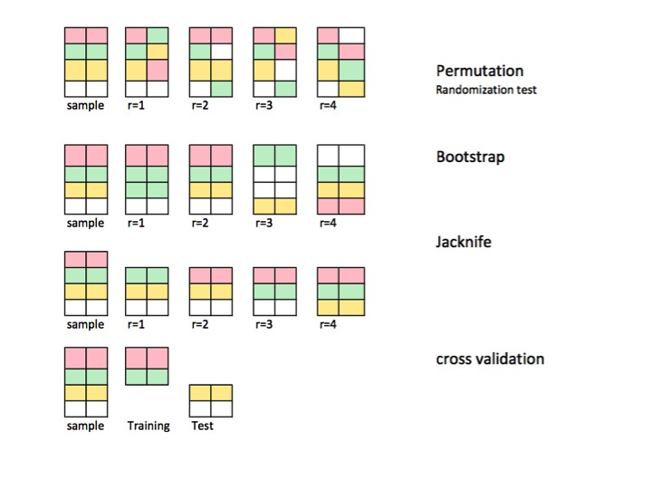
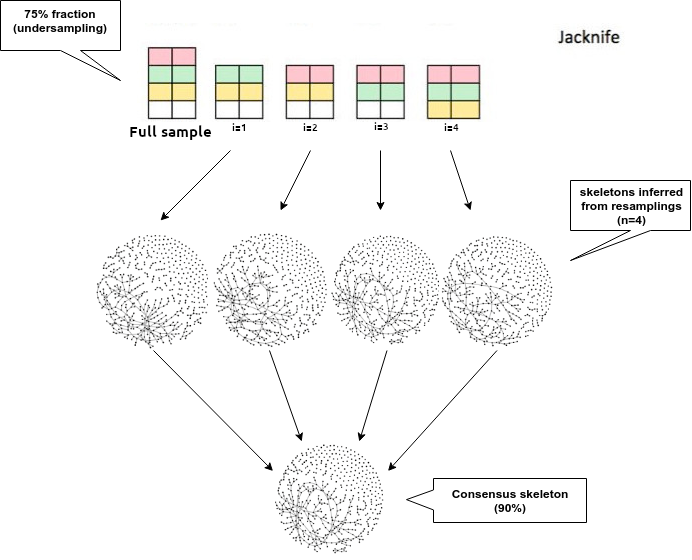
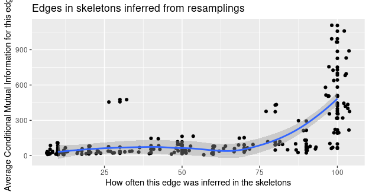
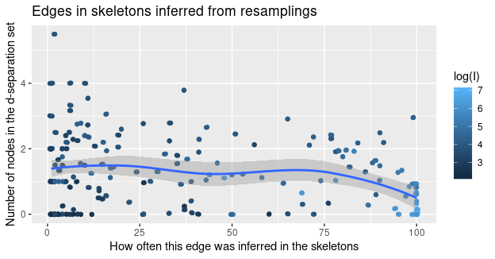
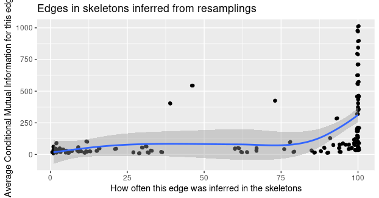
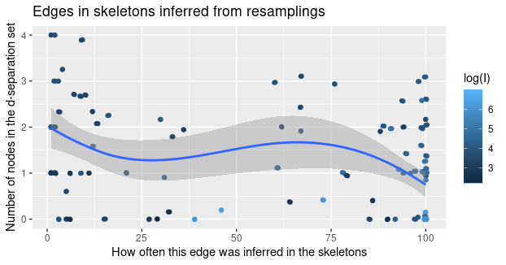
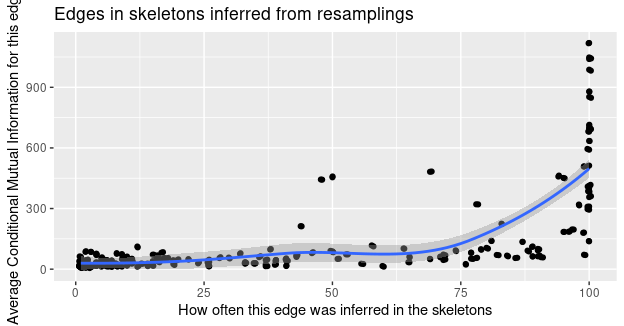
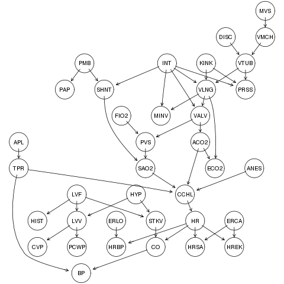

```{r setup, include=FALSE}
knitr::opts_chunk$set(echo = TRUE, message=FALSE, warning=FALSE)
```

# Robustness analysis
The goal of this feature is to evaluate the effect of small variations in the sample used as input to the MIIC algorithm, so that we can measure its robustness to such events.

# Proposed solution
One way to do such analysis is by resampling the original sample $N$ (nSkeletons) times and inferring a skeleton for each of these resamples. Then, the idea is to create a _consensus skeleton_ based on all the inferred skeletons and compare it to the final network, inferred with the original sample. The _consensus skeleton_ is made of all edges that were present in at least $N\%$ (doConsensus) of the skeletons inferred from the resamplings

# Resampling methods
There are several resampling methods, as one can see in the figure below. For now, there are two methods implemented in MIIC: [Bootstraping](#bootstraping) and [jackknife](#jackknife).

```{r resampling_methods, echo=FALSE, fig.cap="Resampling with different methods. Taken from an [StackOverflow answer](https://stats.stackexchange.com/questions/104040/resampling-simulation-methods-monte-carlo-bootstrapping-jackknifing-cross). The networks above are [random](https://rpubs.com/lgadar/generate-graphs) and were used with the parameter for explanatory purposes.", out.width = '100%'}

```

## Bootstraping {#bootstraping}
Bootstraping generally refers to any resampling method that does resamples with replacement. This implies that some samples may not occur at all in the resample, while others may occurr more than once. The boostrap method for the consensus skeleton in MIIC works by taking $N$ (nSkeletons) resamplings with replacement.

## Jackknife {#jackknife}
Jackknife is a resampling method, without replacement, that does undersampling. One example would be to randomly choose 8 out of 10 samples, meaning a fraction of 80%. 

So far, jackknife has been chosen as the resampling method so the proposed solution goes as the following figure:

```{r workflow_consensus_network, echo=FALSE, fig.cap="Workflow to obtain the consensus network. Can be edited [here](https://www.draw.io/#G10BA0KiEFZl_YpKh6mIv2WlOP6cRgdyp0)", out.width = '100%'}

```

# Test dataset
Our proposed solution will be applied to binarized expression data of 33 transcription factors involved in early differentiation of primitive erythroid and endothelial cells (3934 cells). This dataset comes by default in the miic R package.

# Examples
In our example, let's use the _hematoData_ data package contained in the MIIC R package and build the consensus skeleton through 10 and 100 skeletons inferred from resamples.

## N=10
```{r}
library(miic)
data(hematoData)
nske = 10
```

### By bootstrapping
The consensus skeleton will be made of edges that are present in $80\%$ of the skeletons.
```{r eval=FALSE}
set.seed(2019)
miic.res = miic(inputData = hematoData, latent = TRUE, confidenceShuffle = 10,
                confidenceThreshold = 0.001,
                doConsensus = 80,
                nSkeletons = nske)
```

*Results*

```{r echo=TRUE, message=FALSE, eval=FALSE}
library(ggplot2)
library(dplyr)
as_tibble(miic.res$skeletons) %>%
  group_by(x, y) %>%
  summarise(count = n(), I = mean(as.numeric(I))) %>%
  ggplot(aes(x=count*100/nske, y=I)) + geom_point() + geom_jitter(height = 5) +
  geom_smooth() +
  labs(title="Edges in skeletons inferred from resamplings",
       x = "How often this edge was inferred in the skeletons",
       y = "Average Conditional Mutual Information for this edge")
```

```{r bs_fig1_10, echo=FALSE, out.width = '100%'}

```

```{r echo=TRUE, message=FALSE, eval=FALSE}
library(ggplot2)
library(dplyr)
as_tibble(miic.res$skeletons) %>%
  group_by(x, y) %>%
  summarise(count = n(),
            ai_vect = mean(as.numeric(ai_vect_n)),
            I = mean(as.numeric(I))) %>%
  ggplot(aes(x=count*100/nske, y=ai_vect, color = log(I))) + geom_jitter(height = 0.01) + geom_point() +
  geom_smooth() +
  labs(title="Edges in skeletons inferred from resamplings",
       x = "How often this edge was inferred in the skeletons",
       y = "Number of nodes in the d-separation set",
       fill = "Log of average conditional mutual information")
``` 

```{r bs_fig2_10, echo=FALSE, out.width = '100%'}

```

```{r eval=FALSE}
# Comparing final network to consensus skeleton
final_network <- as.data.frame(cbind(miic.res$retained.edges.summary$x,
                                     miic.res$retained.edges.summary$y))
colnames(final_network) <- colnames(miic.res$consensus_table) <- c('x', 'y')

# Proportion of final network which is not in the consensus table
n_edges_not_in_consensus <- nrow(dplyr::setdiff(final_network,
                                                miic.res$consensus_table))
n_total_final_network <- nrow(final_network)
prop_edges_not_in_consensus <- n_edges_not_in_consensus*100/n_total_final_network
prop_edges_in_consensus <- 100-prop_edges_not_in_consensus
paste0(prop_edges_in_consensus, '% of similarity')
```

[1] "65.3333333333333% of similarity"

### By jackknife
The consensus skeleton will be made of edges that are present in $80\%$ of the skeletons, and the resampling will be done randomly from $90\%$
of the original sample.
```{r eval=FALSE}
set.seed(2019)
miic.res = miic(inputData = hematoData, latent = TRUE, confidenceShuffle = 10,
                confidenceThreshold = 0.001,
                doConsensus = 80,
                nSkeletons = nske,
                proportionToUndersample = 90)
```

*Results*

```{r echo=TRUE, message=FALSE, eval=FALSE}
library(ggplot2)
library(dplyr)
as_tibble(miic.res$skeletons) %>%
  group_by(x, y) %>%
  summarise(count = n(), I = mean(as.numeric(I))) %>%
  ggplot(aes(x=count*100/nske, y=I)) + geom_point() + geom_jitter(height = 5) +
  geom_smooth() +
  labs(title="Edges in skeletons inferred from resamplings",
       x = "How often this edge was inferred in the skeletons",
       y = "Average Conditional Mutual Information for this edge")
```

```{r jk_fig1_10, echo=FALSE, out.width = '100%'}


```

```{r echo=TRUE, message=FALSE, eval=FALSE}
library(ggplot2)
library(dplyr)
as_tibble(miic.res$skeletons) %>%
  group_by(x, y) %>%
  summarise(count = n(),
            ai_vect = mean(as.numeric(ai_vect_n)),
            I = mean(as.numeric(I))) %>%
  ggplot(aes(x=count*100/nske, y=ai_vect, color = log(I))) + geom_jitter(height = 0.01) + geom_point() +
  geom_smooth() +
  labs(title="Edges in skeletons inferred from resamplings",
       x = "How often this edge was inferred in the skeletons",
       y = "Number of nodes in the d-separation set",
       fill = "Log of average conditional mutual information")
``` 

```{r jk_fig2_10, echo=FALSE, out.width = '100%'}

```

```{r eval=FALSE}
# Comparing final network to consensus skeleton
final_network <- as.data.frame(cbind(miic.res$retained.edges.summary$x,
                                     miic.res$retained.edges.summary$y))
colnames(final_network) <- colnames(miic.res$consensus_table) <- c('x', 'y')

# Proportion of final network which is not in the consensus table
n_edges_not_in_consensus <- nrow(dplyr::setdiff(final_network,
                                                miic.res$consensus_table))
n_total_final_network <- nrow(final_network)
prop_edges_not_in_consensus <- n_edges_not_in_consensus*100/n_total_final_network
prop_edges_in_consensus <- 100-prop_edges_not_in_consensus
paste0(prop_edges_in_consensus, '% of similarity')
```

[1] "86.6666666666667% of similarity"

## N=100
```{r}
library(miic)
data(hematoData)
nske = 100
```

### By bootstrapping
The consensus skeleton will be made of edges that are present in $80\%$ of the skeletons.
```{r eval=FALSE}
set.seed(2019)
miic.res = miic(inputData = hematoData, latent = TRUE, confidenceShuffle = 10,
                confidenceThreshold = 0.001,
                doConsensus = 80,
                nSkeletons = nske)
```

*Results*

```{r echo=TRUE, message=FALSE, eval=FALSE}
library(ggplot2)
library(dplyr)
as_tibble(miic.res$skeletons) %>%
  group_by(x, y) %>%
  summarise(count = n(), I = mean(as.numeric(I))) %>%
  ggplot(aes(x=count*100/nske, y=I)) + geom_point() + geom_jitter(height = 5) +
  geom_smooth() +
  labs(title="Edges in skeletons inferred from resamplings",
       x = "How often this edge was inferred in the skeletons",
       y = "Average Conditional Mutual Information for this edge")
```

```{r bs_fig1_100, echo=FALSE, out.width = '100%'}

```

```{r echo=TRUE, message=FALSE, eval=FALSE}
library(ggplot2)
library(dplyr)
as_tibble(miic.res$skeletons) %>%
  group_by(x, y) %>%
  summarise(count = n(),
            ai_vect = mean(as.numeric(ai_vect_n)),
            I = mean(as.numeric(I))) %>%
  ggplot(aes(x=count*100/nske, y=ai_vect, color = log(I))) + geom_jitter(height = 0.01) + geom_point() +
  geom_smooth() +
  labs(title="Edges in skeletons inferred from resamplings",
       x = "How often this edge was inferred in the skeletons",
       y = "Number of nodes in the d-separation set",
       fill = "Log of average conditional mutual information")
``` 

```{r bs_fig2_100, echo=FALSE, out.width = '100%'}

```

```{r eval=FALSE}
# Comparing final network to consensus skeleton
final_network <- as.data.frame(cbind(miic.res$retained.edges.summary$x,
                                     miic.res$retained.edges.summary$y))
colnames(final_network) <- colnames(miic.res$consensus_table) <- c('x', 'y')

# Proportion of final network which is not in the consensus table
n_edges_not_in_consensus <- nrow(dplyr::setdiff(final_network,
                                                miic.res$consensus_table))
n_total_final_network <- nrow(final_network)
prop_edges_not_in_consensus <- n_edges_not_in_consensus*100/n_total_final_network
prop_edges_in_consensus <- 100-prop_edges_not_in_consensus
paste0(prop_edges_in_consensus, '% of similarity')
```

[1] "60% of similarity"

### By jackknife
The consensus skeleton will be made of edges that are present in $80\%$ of the skeletons, and the resampling will be done randomly from $90\%$
of the original sample.
```{r eval=FALSE}
set.seed(2019)
miic.res = miic(inputData = hematoData, latent = TRUE, confidenceShuffle = 10,
                confidenceThreshold = 0.001,
                doConsensus = 80,
                nSkeletons = nske,
                proportionToUndersample = 90)
```

*Results*

```{r echo=TRUE, message=FALSE, eval=FALSE}
library(ggplot2)
library(dplyr)
as_tibble(miic.res$skeletons) %>%
  group_by(x, y) %>%
  summarise(count = n(), I = mean(as.numeric(I))) %>%
  ggplot(aes(x=count*100/nske, y=I)) + geom_point() + geom_jitter(height = 5) +
  geom_smooth() +
  labs(title="Edges in skeletons inferred from resamplings",
       x = "How often this edge was inferred in the skeletons",
       y = "Average Conditional Mutual Information for this edge")
```

```{r jk_fig1_100, echo=FALSE, out.width = '100%'}

```

```{r echo=TRUE, message=FALSE, eval=FALSE}
library(ggplot2)
library(dplyr)
as_tibble(miic.res$skeletons) %>%
  group_by(x, y) %>%
  summarise(count = n(),
            ai_vect = mean(as.numeric(ai_vect_n)),
            I = mean(as.numeric(I))) %>%
  ggplot(aes(x=count*100/nske, y=ai_vect, color = log(I))) + geom_jitter(height = 0.01) + geom_point() +
  geom_smooth() +
  labs(title="Edges in skeletons inferred from resamplings",
       x = "How often this edge was inferred in the skeletons",
       y = "Number of nodes in the d-separation set",
       fill = "Log of average conditional mutual information")
``` 

```{r jk_fig2_100, echo=FALSE, out.width = '100%'}

```

```{r eval=FALSE}
# Comparing final network to consensus skeleton
final_network <- as.data.frame(cbind(miic.res$retained.edges.summary$x,
                                     miic.res$retained.edges.summary$y))
colnames(final_network) <- colnames(miic.res$consensus_table) <- c('x', 'y')

# Proportion of final network which is not in the consensus table
n_edges_not_in_consensus <- nrow(dplyr::setdiff(final_network,
                                                miic.res$consensus_table))
n_total_final_network <- nrow(final_network)
prop_edges_not_in_consensus <- n_edges_not_in_consensus*100/n_total_final_network
prop_edges_in_consensus <- 100-prop_edges_not_in_consensus
paste0(prop_edges_in_consensus, '% of similarity')
```

[1] "82.6666666666667% of similarity"

# Evaluating parameters
The idea is to evaluate the parameters used for the resampling approach. These parameters are the number of skeletons to build the consensus skeleton, the minimum occurrence of an edge in these skeletons to be included in the consensus skeleton and the proportion of the original data to be randomly undersampled to be given as input for each skeleton.

There is no point in having very small steps, such as consensus from 1 to 100, one by one. The differences, keeping other parameters still, would be very small to realize. Mostly noise. Besides, the amount of time to run these three loops would take a hueg amount of time. This way, I decided to have larger steps.

## Jackknife
I initially tried to do everything in RStudio but at every iteration the amount of RAM was growing absurdly, even if not keeping any data from the previous iteration (except counters, that is, i,j and k). A solution for that was to write an R script and a shell script that would call the former iteratively.

### With edge filtering
The R script code is shown below:

```{r eval=FALSE}
library(dplyr)
library(ggplot2)
library(optparse)
library(miic)

# Running robustness evaluation algorithm per se
robustness_evaluation <- function(nSkeletons, consensus, fraction,
                                  seed=2019) {
  setwd('/home/mribeirodantas/dev/miic_r_package/tmp/figs/loops/edge_filtering_both')
  set.seed(seed)
  # Running MIIC
  miic.res = miic(inputData = hematoData, latent = TRUE, confidenceShuffle = 10,
                  confidenceThreshold = 0.001,
                  doConsensus = consensus,
                  nSkeletons = nSkeletons,
                  proportionToUndersample = fraction)
  # Plotting average CI by edge
  as_tibble(miic.res$skeletons) %>%
    group_by(x, y) %>%
    summarise(count = n(), I = mean(as.numeric(I))) %>%
    ggplot(aes(x=count*100/nSkeletons, y=I)) + geom_point() + geom_jitter(height = 5) +
    geom_smooth() +
    labs(title="Edges in skeletons inferred from resamplings",
         x = "How often this edge was inferred in the skeletons",
         y = "Average Conditional Mutual Information for this edge")
  ggsave(paste("CI", consensus, nSkeletons, fraction, ".jpg", sep = ' '))
  # Plotting number of nodes in d-separation set
  as_tibble(miic.res$skeletons) %>%
    group_by(x, y) %>%
    summarise(count = n(),
              ai_vect = mean(as.numeric(ai_vect_n)),
              I = mean(as.numeric(I))) %>%
    ggplot(aes(x=count*100/nSkeletons, y=ai_vect, color = log(I))) + geom_jitter(height = 0.01) + geom_point() +
    geom_smooth() +
    labs(title="Edges in skeletons inferred from resamplings",
         x = "How often this edge was inferred in the skeletons",
         y = "Number of nodes in the d-separation set",
         fill = "Log of average conditional mutual information")
  ggsave(paste("d-sep", consensus, nSkeletons, fraction, ".jpg", sep = ' '))
  # Proportion of similarity
  final_network <- as.data.frame(cbind(miic.res$retained.edges.summary$x,
                                       miic.res$retained.edges.summary$y))
  colnames(final_network) <- colnames(miic.res$consensus_table) <- c('x', 'y')
  # Proportion of final network which is not in the consensus table
  n_edges_not_in_consensus <- nrow(dplyr::setdiff(final_network,
                                                  miic.res$consensus_table))
  n_total_final_network <- nrow(final_network)
  prop_edges_not_in_consensus <- n_edges_not_in_consensus*100/n_total_final_network
  prop_edges_in_consensus <- 100-prop_edges_not_in_consensus
  write(paste0(prop_edges_in_consensus, ',',
               consensus, ',',
               nSkeletons, ',',
               fraction),
        file="percent_similarity.txt",append=TRUE)
}

# Handling arguments
option_list = list(
  make_option(c("-n", "--nSkeletons"), type="integer", default=10,
              help=paste("number of skeletons inferred for consensus skeleton",
                         "[default= %default]."),
              metavar="integer"),
  make_option(c("-c", "--consensus"), type="integer", default=80,
              help=paste("frequency of occurrence for adding edge to consensus",
              "network [default= %default]."),
              metavar="integer"),
  make_option(c("-f", "--fraction"), type="integer", default=90,
              help=paste("fraction that will be randomly sampled from original",
              "data [default= %default]."),
              metavar="integer"),
  make_option(c("-s", "--seed"), type="integer", default=2019,
              help="seed for reproduction of results [default= %default].",
              metavar="integer"),
  make_option(c("-d", "--destinationPath"),
              help="output destination [default= %default].",
              metavar="string")
);

opt_parser = OptionParser(option_list=option_list);
opt = parse_args(opt_parser);

# Calling code with handled arguments
robustness_evaluation(nSkeletons = opt$nSkeletons,
                      consensus = opt$consensus,
                      fraction = opt$fraction,
                      seed = opt$seed)
```

The code above, within an R script file, is called by the shell script below:

```{r eval=FALSE}
#!/usr/bin/sh

#!/bin/sh
for i in `seq 50 10 100`
do
  for j in `seq 10 10 100`
  do
    for k in `seq 80 5 95`
    do
      Rscript robustness_evaluation.R -n $j -c $i -f $k -s 2019 -d "/home/mribeirodantas/dev/miic_r_package/tmp/figs/loops"
    done
  done
done
```

With both files in the same file directory, the following command line should be run:

```{r eval=FALSE}
./call_robustness_evaluation.sh
```

#### Analysis of results

One way of visualize the result is through a scatter plot, where every dot is a simulation in a 3D-plot where X=nSkeletons, Y=Consensus and Z=Fraction. The edge will also be colored according to the accuracy between the consensus skeleton and the final skeleton.

The code below is only run in RStudio.
```{r eval=FALSE}
library(dplyr)
library(plot3Drgl)

setwd('tmp/figs/loops/')
df <- as_tibble(read.csv2(file = 'percent_similarity.txt', sep = ',',
                          header = FALSE, stringsAsFactors = FALSE))
colnames(df) <- c('accuracy', 'consensus', 'nskeleton', 'fraction')
df$accuracy <- as.numeric(df$accuracy)

library(plot3D)

scatter3D(x = df$nskeleton, z = df$consensus, y = df$fraction,
          colvar = df$accuracy, clab = c("Accuracy"), pch = 19,
          ticktype = "detailed",
          bty = "b2", phi = 0, ylim=c(1,100), zlim=c(1,100),
          xlim=c(1,100), zlab = c('% Consensus'), ylab = c('% fraction used'),
          xlab = c('nSkeletons')
          ) # try also without specifying phi
# 3d interactive plot locally
plotrgl()
```

```{r output_local_3D_wo_ef, echo=FALSE, fig.cap="3D plot of the simulation", out.width = '100%'}
knitr::include_graphics("/home/mribeirodantas/dev/miic_r_package/tmp/figs/3D_output_default_w_ef.png")
```

This code produces the 3D interactive plot in this report.
```{r, message=FALSE}
library(threejs)
library(dplyr)

setwd('/home/mribeirodantas/dev/miic_r_package/tmp/figs/loops/wo_edge_filtering')
df <- as_tibble(read.csv2(file = 'percent_similarity.txt', sep = ',',
                          header = FALSE, stringsAsFactors = FALSE))
colnames(df) <- c('accuracy', 'consensus', 'nskeleton', 'fraction')
df$accuracy <- as.numeric(df$accuracy)

scatterplot3js(x = df$nskeleton, z = df$consensus, y = df$fraction,
               color = rainbow(length(df$accuracy)), main=paste("Hover mouse",
               " over dots to check accuraccy"),
               labels=as.character(df$accuracy),
               xlim=c(10,100),
               ylim=c(10,100),
               zlim=c(10,100),
               size=0.5)
```

How much does accuracy vary through these parameters?
```{r eval=FALSE}
library(dplyr)

nskeletons_min <- df %>%
  filter(nskeleton == min(df$nskeleton)) %>%
  summarise(min = min(accuracy), max = max(accuracy))
nskeletons_max <- df %>%
  filter(nskeleton == max(df$nskeleton)) %>%
  summarise(min = min(accuracy), max = max(accuracy))
diff <- nskeletons_max - nskeletons_min
colnames(diff) <- c('diff in min (nskeletons)', 'diff in max (nskeletons)')
abs(diff)

fraction_min <- df %>%
  filter(fraction == min(df$fraction)) %>%
  summarise(min = min(accuracy), max = max(accuracy))
fraction_max <- df %>%
  filter(fraction == max(df$fraction)) %>%
  summarise(min = min(accuracy), max = max(accuracy))
diff <- fraction_max - fraction_min
colnames(diff) <- c('diff in min (fraction)', 'diff in max (fraction)')
abs(diff)

consensus_min <- df %>%
  filter(consensus == min(df$consensus)) %>%
  summarise(min = min(accuracy), max = max(accuracy))
consensus_max <- df %>%
  filter(consensus == max(df$consensus)) %>%
  summarise(min = min(accuracy), max = max(accuracy))
diff <- consensus_max - consensus_min
colnames(diff) <- c('diff in min (consensus)', 'diff in max (consensus)')
abs(diff)

```

```{r echo=FALSE, eval=TRUE}
library(dplyr)

df <- matrix(c(10.666667, 0), ncol = 2, nrow = 1)
colnames(df) <- c('diff in min (nskeletons)', 'diff in max (nskeletons)')
as.data.frame(df)

df <- matrix(c(22.66667, 1.333333), ncol = 2, nrow = 1)
colnames(df) <- c('diff in min (fraction)', 'diff in max (fraction)')
as.data.frame(df)

df <- matrix(c(45.333333, 21.333333), ncol = 2, nrow = 1)
colnames(df) <- c('diff in min (consensus)', 'diff in max (consensus)')
as.data.frame(df)
```

### Without edge filtering
The R script code is shown below:

```{r eval=FALSE}
library(dplyr)
library(ggplot2)
library(optparse)
library(miic)

# Running robustness evaluation algorithm per se
robustness_evaluation <- function(nSkeletons, consensus, fraction,
                                  seed=2019) {
  setwd('/home/mribeirodantas/dev/miic_r_package/tmp/figs/loops/wo_edge_filtering')
  set.seed(seed)
  # Running MIIC
  miic.res = miic(inputData = hematoData, latent = TRUE,
                  doConsensus = consensus,
                  nSkeletons = nSkeletons,
                  proportionToUndersample = fraction)
  # Plotting average CI by edge
  as_tibble(miic.res$skeletons) %>%
    group_by(x, y) %>%
    summarise(count = n(), I = mean(as.numeric(I))) %>%
    ggplot(aes(x=count*100/nSkeletons, y=I)) + geom_point() + geom_jitter(height = 5) +
    geom_smooth() +
    labs(title="Edges in skeletons inferred from resamplings",
         x = "How often this edge was inferred in the skeletons",
         y = "Average Conditional Mutual Information for this edge")
  ggsave(paste("CI", consensus, nSkeletons, fraction, ".jpg", sep = ' '))
  # Plotting number of nodes in d-separation set
  as_tibble(miic.res$skeletons) %>%
    group_by(x, y) %>%
    summarise(count = n(),
              ai_vect = mean(as.numeric(ai_vect_n)),
              I = mean(as.numeric(I))) %>%
    ggplot(aes(x=count*100/nSkeletons, y=ai_vect, color = log(I))) + geom_jitter(height = 0.01) + geom_point() +
    geom_smooth() +
    labs(title="Edges in skeletons inferred from resamplings",
         x = "How often this edge was inferred in the skeletons",
         y = "Number of nodes in the d-separation set",
         fill = "Log of average conditional mutual information")
  ggsave(paste("d-sep", consensus, nSkeletons, fraction, ".jpg", sep = ' '))
  # Proportion of similarity
  final_network <- as.data.frame(cbind(miic.res$retained.edges.summary$x,
                                       miic.res$retained.edges.summary$y))
  colnames(final_network) <- colnames(miic.res$consensus_table) <- c('x', 'y')
  # Proportion of final network which is not in the consensus table
  n_edges_not_in_consensus <- nrow(dplyr::setdiff(final_network,
                                                  miic.res$consensus_table))
  n_total_final_network <- nrow(final_network)
  prop_edges_not_in_consensus <- n_edges_not_in_consensus*100/n_total_final_network
  prop_edges_in_consensus <- 100-prop_edges_not_in_consensus
  write(paste0(prop_edges_in_consensus, ',',
               consensus, ',',
               nSkeletons, ',',
               fraction),
        file="percent_similarity.txt",append=TRUE)
}

# Handling arguments
option_list = list(
  make_option(c("-n", "--nSkeletons"), type="integer", default=10,
              help=paste("number of skeletons inferred for consensus skeleton",
                         "[default= %default]."),
              metavar="integer"),
  make_option(c("-c", "--consensus"), type="integer", default=80,
              help=paste("frequency of occurrence for adding edge to consensus",
              "network [default= %default]."),
              metavar="integer"),
  make_option(c("-f", "--fraction"), type="integer", default=90,
              help=paste("fraction that will be randomly sampled from original",
              "data [default= %default]."),
              metavar="integer"),
  make_option(c("-s", "--seed"), type="integer", default=2019,
              help="seed for reproduction of results [default= %default].",
              metavar="integer"),
  make_option(c("-d", "--destinationPath"),
              help="output destination [default= %default].",
              metavar="string")
);

opt_parser = OptionParser(option_list=option_list);
opt = parse_args(opt_parser);

# Calling code with handled arguments
robustness_evaluation(nSkeletons = opt$nSkeletons,
                      consensus = opt$consensus,
                      fraction = opt$fraction,
                      seed = opt$seed)
```

The code above, within an R script file, is called by the shell script below:

```{r eval=FALSE}
#!/usr/bin/sh

#!/bin/sh
for i in `seq 50 10 100`
do
  for j in `seq 10 10 100`
  do
    for k in `seq 80 5 95`
    do
      Rscript robustness_evaluation.R -n $j -c $i -f $k -s 2019 -d "/home/mribeirodantas/dev/miic_r_package/tmp/figs/loops/wo_edge_filtering"
    done
  done
done
```

With both files in the same file directory, the following command line should be run:

```{r eval=FALSE}
./call_robustness_evaluation.sh
```

#### Analysis of results

One way of visualize the result is through a scatter plot, where every dot is a simulation in a 3D-plot where X=nSkeletons, Y=Consensus and Z=Fraction. The edge will also be colored according to the accuracy between the consensus skeleton and the final skeleton.

The code below is only run in RStudio.
```{r eval=FALSE}
library(dplyr)
library(plot3Drgl)

setwd('tmp/figs/loops/wo_edge_filtering/')
df <- as_tibble(read.csv2(file = 'percent_similarity.txt', sep = ',',
                          header = FALSE, stringsAsFactors = FALSE))
colnames(df) <- c('accuracy', 'consensus', 'nskeleton', 'fraction')
df$accuracy <- as.numeric(df$accuracy)

library(plot3D)

scatter3D(x = df$nskeleton, z = df$consensus, y = df$fraction,
          colvar = df$accuracy, clab = c("Accuracy"), pch = 19,
          ticktype = "detailed",
          bty = "b2", phi = 0, ylim=c(1,100), zlim=c(1,100),
          xlim=c(1,100), zlab = c('% Consensus'), ylab = c('% fraction used'),
          xlab = c('nSkeletons')
          ) # try also without specifying phi
# 3d interactive plot locally
plotrgl()
```

```{r output_local_3D, echo=FALSE, fig.cap="3D plot of the simulation", out.width = '100%'}
knitr::include_graphics("/home/mribeirodantas/dev/miic_r_package/tmp/figs/3D_output_default_w_ef.png")
```

This code produces the 3D interactive plot in this report.
```{r, message=FALSE}
library(threejs)
library(dplyr)

setwd('/home/mribeirodantas/dev/miic_r_package/tmp/figs/loops/wo_edge_filtering/')
df <- as_tibble(read.csv2(file = 'percent_similarity.txt', sep = ',',
                          header = FALSE, stringsAsFactors = FALSE))
colnames(df) <- c('accuracy', 'consensus', 'nskeleton', 'fraction')
df$accuracy <- as.numeric(df$accuracy)

scatterplot3js(x = df$nskeleton, z = df$consensus, y = df$fraction,
               color = rainbow(length(df$accuracy)), main=paste("Hover mouse",
               " over dots to check accuraccy"),
               labels=as.character(df$accuracy),
               xlim=c(10,100),
               ylim=c(10,100),
               zlim=c(10,100),
               size=0.5)
```

How much does accuracy vary through these parameters?
```{r eval=FALSE}
library(dplyr)

nskeletons_min <- df %>%
  filter(nskeleton == min(df$nskeleton)) %>%
  summarise(min = min(accuracy), max = max(accuracy))
nskeletons_max <- df %>%
  filter(nskeleton == max(df$nskeleton)) %>%
  summarise(min = min(accuracy), max = max(accuracy))
diff <- nskeletons_max - nskeletons_min
colnames(diff) <- c('diff in min (nskeletons)', 'diff in max (nskeletons)')
abs(diff)

fraction_min <- df %>%
  filter(fraction == min(df$fraction)) %>%
  summarise(min = min(accuracy), max = max(accuracy))
fraction_max <- df %>%
  filter(fraction == max(df$fraction)) %>%
  summarise(min = min(accuracy), max = max(accuracy))
diff <- fraction_max - fraction_min
colnames(diff) <- c('diff in min (fraction)', 'diff in max (fraction)')
abs(diff)

consensus_min <- df %>%
  filter(consensus == min(df$consensus)) %>%
  summarise(min = min(accuracy), max = max(accuracy))
consensus_max <- df %>%
  filter(consensus == max(df$consensus)) %>%
  summarise(min = min(accuracy), max = max(accuracy))
diff <- consensus_max - consensus_min
colnames(diff) <- c('diff in min (consensus)', 'diff in max (consensus)')
abs(diff)

```

```{r echo=FALSE, eval=TRUE}
library(dplyr)

df <- matrix(c(15.85366, 0), ncol = 2, nrow = 1)
colnames(df) <- c('diff in min (nskeletons)', 'diff in max (nskeletons)')
as.data.frame(df)

df <- matrix(c(23.17073, 4.878049), ncol = 2, nrow = 1)
colnames(df) <- c('diff in min (fraction)', 'diff in max (fraction)')
as.data.frame(df)

df <- matrix(c(45.12195, 20.73171), ncol = 2, nrow = 1)
colnames(df) <- c('diff in min (consensus)', 'diff in max (consensus)')
as.data.frame(df)
```

### Edge filtering only for skeleton from full dataset
The R script code is shown below:

```{r eval=FALSE}
library(dplyr)
library(ggplot2)
library(optparse)
library(miic)

# Running robustness evaluation algorithm per se
robustness_evaluation <- function(nSkeletons, consensus, fraction,
                                  seed=2019) {
  setwd('/home/mribeirodantas/dev/miic_r_package/tmp/figs/loops/edge_filtering_only_fulldataset/')
  set.seed(seed)
  # Running MIIC
  miic.res = miic(inputData = hematoData, latent = TRUE,
                  doConsensus = consensus,
                  nSkeletons = nSkeletons,
                  proportionToUndersample = fraction)
  # Plotting average CI by edge
  as_tibble(miic.res$skeletons) %>%
    group_by(x, y) %>%
    summarise(count = n(), I = mean(as.numeric(I))) %>%
    ggplot(aes(x=count*100/nSkeletons, y=I)) + geom_point() + geom_jitter(height = 5) +
    geom_smooth() +
    labs(title="Edges in skeletons inferred from resamplings",
         x = "How often this edge was inferred in the skeletons",
         y = "Average Conditional Mutual Information for this edge")
  ggsave(paste("CI", consensus, nSkeletons, fraction, ".jpg", sep = ' '))
  # Plotting number of nodes in d-separation set
  as_tibble(miic.res$skeletons) %>%
    group_by(x, y) %>%
    summarise(count = n(),
              ai_vect = mean(as.numeric(ai_vect_n)),
              I = mean(as.numeric(I))) %>%
    ggplot(aes(x=count*100/nSkeletons, y=ai_vect, color = log(I))) + geom_jitter(height = 0.01) + geom_point() +
    geom_smooth() +
    labs(title="Edges in skeletons inferred from resamplings",
         x = "How often this edge was inferred in the skeletons",
         y = "Number of nodes in the d-separation set",
         fill = "Log of average conditional mutual information")
  ggsave(paste("d-sep", consensus, nSkeletons, fraction, ".jpg", sep = ' '))
  # Proportion of similarity
  final_network <- as.data.frame(cbind(miic.res$retained.edges.summary$x,
                                       miic.res$retained.edges.summary$y))
  colnames(final_network) <- colnames(miic.res$consensus_table) <- c('x', 'y')
  # Proportion of final network which is not in the consensus table
  n_edges_not_in_consensus <- nrow(dplyr::setdiff(final_network,
                                                  miic.res$consensus_table))
  n_total_final_network <- nrow(final_network)
  prop_edges_not_in_consensus <- n_edges_not_in_consensus*100/n_total_final_network
  prop_edges_in_consensus <- 100-prop_edges_not_in_consensus
  write(paste0(prop_edges_in_consensus, ',',
               consensus, ',',
               nSkeletons, ',',
               fraction),
        file="percent_similarity.txt",append=TRUE)
}

# Handling arguments
option_list = list(
  make_option(c("-n", "--nSkeletons"), type="integer", default=10,
              help=paste("number of skeletons inferred for consensus skeleton",
                         "[default= %default]."),
              metavar="integer"),
  make_option(c("-c", "--consensus"), type="integer", default=80,
              help=paste("frequency of occurrence for adding edge to consensus",
              "network [default= %default]."),
              metavar="integer"),
  make_option(c("-f", "--fraction"), type="integer", default=90,
              help=paste("fraction that will be randomly sampled from original",
              "data [default= %default]."),
              metavar="integer"),
  make_option(c("-s", "--seed"), type="integer", default=2019,
              help="seed for reproduction of results [default= %default].",
              metavar="integer"),
  make_option(c("-d", "--destinationPath"),
              help="output destination [default= %default].",
              metavar="string")
);

opt_parser = OptionParser(option_list=option_list);
opt = parse_args(opt_parser);

# Calling code with handled arguments
robustness_evaluation(nSkeletons = opt$nSkeletons,
                      consensus = opt$consensus,
                      fraction = opt$fraction,
                      seed = opt$seed)
```

The code above, within an R script file, is called by the shell script below:

```{r eval=FALSE}
#!/usr/bin/sh

#!/bin/sh
for i in `seq 50 10 100`
do
  for j in `seq 10 10 100`
  do
    for k in `seq 80 5 95`
    do
      Rscript robustness_evaluation.R -n $j -c $i -f $k -s 2019 -d "/home/mribeirodantas/dev/miic_r_package/tmp/figs/loops/edge_filtering_only_fulldataset/"
    done
  done
done
```

With both files in the same file directory, the following command line should be run:

```{r eval=FALSE}
./call_robustness_evaluation.sh
```

#### Analysis of results

One way of visualize the result is through a scatter plot, where every dot is a simulation in a 3D-plot where X=nSkeletons, Y=Consensus and Z=Fraction. The edge will also be colored according to the accuracy between the consensus skeleton and the final skeleton.

The code below is only run in RStudio.
```{r eval=FALSE}
library(dplyr)
library(plot3Drgl)

setwd('tmp/figs/loops/edge_filtering_only_fulldataset/')
df <- as_tibble(read.csv2(file = 'percent_similarity.txt', sep = ',',
                          header = FALSE, stringsAsFactors = FALSE))
colnames(df) <- c('accuracy', 'consensus', 'nskeleton', 'fraction')
df$accuracy <- as.numeric(df$accuracy)

library(plot3D)

scatter3D(x = df$nskeleton, z = df$consensus, y = df$fraction,
          colvar = df$accuracy, clab = c("Accuracy"), pch = 19,
          ticktype = "detailed",
          bty = "b2", phi = 0, ylim=c(1,100), zlim=c(1,100),
          xlim=c(1,100), zlab = c('% Consensus'), ylab = c('% fraction used'),
          xlab = c('nSkeletons')
          ) # try also without specifying phi
# 3d interactive plot locally
plotrgl()
```

*Pending resimulation*

```{r output_local_3D_ef_fds, echo=FALSE, eval=FALSE, fig.cap="3D plot of the simulation", out.width = '100%'}
knitr::include_graphics("/home/mribeirodantas/dev/miic_r_package/tmp/figs/3D_output_default_w_ef_fds.png")
```

This code produces the 3D interactive plot in this report.

*Pending resimulation*

```{r, eval=FALSE, message=FALSE}
library(threejs)
library(dplyr)

setwd('/home/mribeirodantas/dev/miic_r_package/tmp/figs/loops/edge_filtering_only_fulldataset/')
df <- as_tibble(read.csv2(file = 'percent_similarity.txt', sep = ',',
                          header = FALSE, stringsAsFactors = FALSE))
colnames(df) <- c('accuracy', 'consensus', 'nskeleton', 'fraction')
df$accuracy <- as.numeric(df$accuracy)

scatterplot3js(x = df$nskeleton, z = df$consensus, y = df$fraction,
               color = rainbow(length(df$accuracy)), main=paste("Hover mouse",
               " over dots to check accuraccy"),
               labels=as.character(df$accuracy),
               xlim=c(10,100),
               ylim=c(10,100),
               zlim=c(10,100),
               size=0.5)
```

How much does accuracy vary through these parameters?
```{r eval=FALSE}
library(dplyr)

nskeletons_min <- df %>%
  filter(nskeleton == min(df$nskeleton)) %>%
  summarise(min = min(accuracy), max = max(accuracy))
nskeletons_max <- df %>%
  filter(nskeleton == max(df$nskeleton)) %>%
  summarise(min = min(accuracy), max = max(accuracy))
diff <- nskeletons_max - nskeletons_min
colnames(diff) <- c('diff in min (nskeletons)', 'diff in max (nskeletons)')
abs(diff)

fraction_min <- df %>%
  filter(fraction == min(df$fraction)) %>%
  summarise(min = min(accuracy), max = max(accuracy))
fraction_max <- df %>%
  filter(fraction == max(df$fraction)) %>%
  summarise(min = min(accuracy), max = max(accuracy))
diff <- fraction_max - fraction_min
colnames(diff) <- c('diff in min (fraction)', 'diff in max (fraction)')
abs(diff)

consensus_min <- df %>%
  filter(consensus == min(df$consensus)) %>%
  summarise(min = min(accuracy), max = max(accuracy))
consensus_max <- df %>%
  filter(consensus == max(df$consensus)) %>%
  summarise(min = min(accuracy), max = max(accuracy))
diff <- consensus_max - consensus_min
colnames(diff) <- c('diff in min (consensus)', 'diff in max (consensus)')
abs(diff)

```

```{r echo=FALSE, eval=TRUE}
library(dplyr)

df <- matrix(c(16, 0), ncol = 2, nrow = 1)
colnames(df) <- c('diff in min (nskeletons)', 'diff in max (nskeletons)')
as.data.frame(df)

df <- matrix(c(26.66667, 0), ncol = 2, nrow = 1)
colnames(df) <- c('diff in min (fraction)', 'diff in max (fraction)')
as.data.frame(df)

df <- matrix(c(48, 10.66667), ncol = 2, nrow = 1)
colnames(df) <- c('diff in min (consensus)', 'diff in max (consensus)')
as.data.frame(df)
```

### Edge filtering only for skeletons from resampled dataset
The R script code is shown below:

```{r eval=FALSE}
library(dplyr)
library(ggplot2)
library(optparse)
library(miic)

# Running robustness evaluation algorithm per se
robustness_evaluation <- function(nSkeletons, consensus, fraction,
                                  seed=2019) {
  setwd('/home/mribeirodantas/dev/miic_r_package/tmp/figs/loops/only_resamplings/')
  set.seed(seed)
  # Running MIIC
  miic.res = miic(inputData = hematoData, latent = TRUE,
                  doConsensus = consensus,
                  nSkeletons = nSkeletons,
                  proportionToUndersample = fraction)
  # Plotting average CI by edge
  as_tibble(miic.res$skeletons) %>%
    group_by(x, y) %>%
    summarise(count = n(), I = mean(as.numeric(I))) %>%
    ggplot(aes(x=count*100/nSkeletons, y=I)) + geom_point() + geom_jitter(height = 5) +
    geom_smooth() +
    labs(title="Edges in skeletons inferred from resamplings",
         x = "How often this edge was inferred in the skeletons",
         y = "Average Conditional Mutual Information for this edge")
  ggsave(paste("CI", consensus, nSkeletons, fraction, ".jpg", sep = ' '))
  # Plotting number of nodes in d-separation set
  as_tibble(miic.res$skeletons) %>%
    group_by(x, y) %>%
    summarise(count = n(),
              ai_vect = mean(as.numeric(ai_vect_n)),
              I = mean(as.numeric(I))) %>%
    ggplot(aes(x=count*100/nSkeletons, y=ai_vect, color = log(I))) + geom_jitter(height = 0.01) + geom_point() +
    geom_smooth() +
    labs(title="Edges in skeletons inferred from resamplings",
         x = "How often this edge was inferred in the skeletons",
         y = "Number of nodes in the d-separation set",
         fill = "Log of average conditional mutual information")
  ggsave(paste("d-sep", consensus, nSkeletons, fraction, ".jpg", sep = ' '))
  # Proportion of similarity
  final_network <- as.data.frame(cbind(miic.res$retained.edges.summary$x,
                                       miic.res$retained.edges.summary$y))
  colnames(final_network) <- colnames(miic.res$consensus_table) <- c('x', 'y')
  # Proportion of final network which is not in the consensus table
  n_edges_not_in_consensus <- nrow(dplyr::setdiff(final_network,
                                                  miic.res$consensus_table))
  n_total_final_network <- nrow(final_network)
  prop_edges_not_in_consensus <- n_edges_not_in_consensus*100/n_total_final_network
  prop_edges_in_consensus <- 100-prop_edges_not_in_consensus
  write(paste0(prop_edges_in_consensus, ',',
               consensus, ',',
               nSkeletons, ',',
               fraction),
        file="percent_similarity.txt",append=TRUE)
}

# Handling arguments
option_list = list(
  make_option(c("-n", "--nSkeletons"), type="integer", default=10,
              help=paste("number of skeletons inferred for consensus skeleton",
                         "[default= %default]."),
              metavar="integer"),
  make_option(c("-c", "--consensus"), type="integer", default=80,
              help=paste("frequency of occurrence for adding edge to consensus",
              "network [default= %default]."),
              metavar="integer"),
  make_option(c("-f", "--fraction"), type="integer", default=90,
              help=paste("fraction that will be randomly sampled from original",
              "data [default= %default]."),
              metavar="integer"),
  make_option(c("-s", "--seed"), type="integer", default=2019,
              help="seed for reproduction of results [default= %default].",
              metavar="integer"),
  make_option(c("-d", "--destinationPath"),
              help="output destination [default= %default].",
              metavar="string")
);

opt_parser = OptionParser(option_list=option_list);
opt = parse_args(opt_parser);

# Calling code with handled arguments
robustness_evaluation(nSkeletons = opt$nSkeletons,
                      consensus = opt$consensus,
                      fraction = opt$fraction,
                      seed = opt$seed)
```

The code above, within an R script file, is called by the shell script below:

```{r eval=FALSE}
#!/usr/bin/sh

#!/bin/sh
for i in `seq 50 10 100`
do
  for j in `seq 10 10 100`
  do
    for k in `seq 80 5 95`
    do
      Rscript robustness_evaluation.R -n $j -c $i -f $k -s 2019 -d "/home/mribeirodantas/dev/miic_r_package/tmp/figs/loops/only_resamplings"
    done
  done
done
```

With both files in the same file directory, the following command line should be run:

```{r eval=FALSE}
./call_robustness_evaluation.sh
```

#### Analysis of results

One way of visualize the result is through a scatter plot, where every dot is a simulation in a 3D-plot where X=nSkeletons, Y=Consensus and Z=Fraction. The edge will also be colored according to the accuracy between the consensus skeleton and the final skeleton.

The code below is only run in RStudio.
```{r eval=FALSE}
library(dplyr)
library(plot3Drgl)

setwd('/home/mribeirodantas/dev/miic_r_package/tmp/figs/loops/only_resamplings/')
df <- as_tibble(read.csv2(file = 'percent_similarity.txt', sep = ',',
                          header = FALSE, stringsAsFactors = FALSE))
colnames(df) <- c('accuracy', 'consensus', 'nskeleton', 'fraction')
df$accuracy <- as.numeric(df$accuracy)

library(plot3D)

scatter3D(x = df$nskeleton, z = df$consensus, y = df$fraction,
          colvar = df$accuracy, clab = c("Accuracy"), pch = 19,
          ticktype = "detailed",
          bty = "b2", phi = 0, ylim=c(1,100), zlim=c(1,100),
          xlim=c(1,100), zlab = c('% Consensus'), ylab = c('% fraction used'),
          xlab = c('nSkeletons')
          ) # try also without specifying phi
# 3d interactive plot locally
plotrgl()
```

```{r output_local_3D_ef_rds, echo=FALSE, fig.cap="3D plot of the simulation", out.width = '100%'}
knitr::include_graphics("/home/mribeirodantas/dev/miic_r_package/tmp/figs/3D_output_default_w_ef_rds.png")
```

This code produces the 3D interactive plot in this report.
```{r, message=FALSE}
library(threejs)
library(dplyr)

setwd('/home/mribeirodantas/dev/miic_r_package/tmp/figs/loops/wo_edge_filtering/')
df <- as_tibble(read.csv2(file = 'percent_similarity.txt', sep = ',',
                          header = FALSE, stringsAsFactors = FALSE))
colnames(df) <- c('accuracy', 'consensus', 'nskeleton', 'fraction')
df$accuracy <- as.numeric(df$accuracy)

scatterplot3js(x = df$nskeleton, z = df$consensus, y = df$fraction,
               color = rainbow(length(df$accuracy)), main=paste("Hover mouse",
               " over dots to check accuraccy"),
               labels=as.character(df$accuracy),
               xlim=c(10,100),
               ylim=c(10,100),
               zlim=c(10,100),
               size=0.5)
```

How much does accuracy vary through these parameters?
```{r eval=FALSE}
library(dplyr)

nskeletons_min <- df %>%
  filter(nskeleton == min(df$nskeleton)) %>%
  summarise(min = min(accuracy), max = max(accuracy))
nskeletons_max <- df %>%
  filter(nskeleton == max(df$nskeleton)) %>%
  summarise(min = min(accuracy), max = max(accuracy))
diff <- nskeletons_max - nskeletons_min
colnames(diff) <- c('diff in min (nskeletons)', 'diff in max (nskeletons)')
abs(diff)

fraction_min <- df %>%
  filter(fraction == min(df$fraction)) %>%
  summarise(min = min(accuracy), max = max(accuracy))
fraction_max <- df %>%
  filter(fraction == max(df$fraction)) %>%
  summarise(min = min(accuracy), max = max(accuracy))
diff <- fraction_max - fraction_min
colnames(diff) <- c('diff in min (fraction)', 'diff in max (fraction)')
abs(diff)

consensus_min <- df %>%
  filter(consensus == min(df$consensus)) %>%
  summarise(min = min(accuracy), max = max(accuracy))
consensus_max <- df %>%
  filter(consensus == max(df$consensus)) %>%
  summarise(min = min(accuracy), max = max(accuracy))
diff <- consensus_max - consensus_min
colnames(diff) <- c('diff in min (consensus)', 'diff in max (consensus)')
abs(diff)

```

```{r echo=FALSE, eval=TRUE}
library(dplyr)

df <- matrix(c(6.097561, 0), ncol = 2, nrow = 1)
colnames(df) <- c('diff in min (nskeletons)', 'diff in max (nskeletons)')
as.data.frame(df)

df <- matrix(c(18.29268, 4.878049), ncol = 2, nrow = 1)
colnames(df) <- c('diff in min (fraction)', 'diff in max (fraction)')
as.data.frame(df)

df <- matrix(c(41.46341, 18.29268), ncol = 2, nrow = 1)
colnames(df) <- c('diff in min (consensus)', 'diff in max (consensus)')
as.data.frame(df)
```

# Benchmarking

The goal of this section is to apply MIIC in two different ways to data whose real network is known. I will first run MIIC with edge filtering and then MIIC with the consensus skeleton and measure which one got closer to the real network through the F-score metric. We will start with the [ALARM](http://www.bnlearn.com/bnrepository/discrete-medium.html#alarm) network, then try with the [INSURANCE](http://www.bnlearn.com/bnrepository/discrete-medium.html#insurance) network which is a bit more complicated and then finally with the [BARLEY](http://www.bnlearn.com/bnrepository/discrete-medium.html#barley) network which is the most complicated of the three networks. The more parameters (number of possible values in the variables), the bigger the sample size required to have a representative understanding of the scenario. All the data and network information was obtained from [here](http://www.bnlearn.com/bnrepository/).

In order to generate samples, one must download the BIF object from the link above related to the chosen network. Then, run the code below, providing the number of samples (n parameter) you wish to generate (based on probability/metada information contained in the BIF object).

```{r eval=FALSE, echo=TRUE}
library(bnlearn)

setwd('/home/mribeirodantas/dev/miic_r_package/tmp/data/real_networks/ALARM/')
myBnNet = read.bif(file='alarm.bif', debug = FALSE)
# Generate 1000 samples
myDataNet = try(rbn(myBnNet, n=1000, debug = F))
```

You can also plot the real network by using the R snippet below.
```{r eval=TRUE, echo=TRUE, message=FALSE}
library(bnlearn)

setwd('/home/mribeirodantas/dev/miic_r_package/tmp/data/real_networks/INSURANCE/')
myBnNet = read.bif(file='insurance.bif', debug = FALSE)

plot(bn.net(myBnNet))
```

A better version of the network can be obtained in the [bnlearn website](http://www.bnlearn.com/bnrepository/discrete-medium.html#alarm) and is shown below.

```{r insurance_real_network, echo=FALSE, out.width = '100%'}

```

One can also check what is the markov blanket of a node X in a markov random field, that is, all nodes that are immediately associated with the node X.
```{r eval=TRUE, echo=TRUE, message=FALSE}
library(bnlearn)

setwd('/home/mribeirodantas/dev/miic_r_package/tmp/data/real_networks/ALARM/')
myBnNet = read.bif(file='alarm.bif', debug = FALSE)

network <- bn.net(myBnNet)
# Markov blanket of the node CATECHOL (CCHL in the network)
print(c(network$nodes$CATECHOL$parents, network$nodes$CATECHOL$children))
```

In order to perform the simulations, I wrote a benchmark script (benchmark.R) whose code is shown below. I generated three cohorts for each of the three datasets. One with 100 samples, 1000 samples and 10,000 samples. Each simulation was run with confidence parameters from 50 to 100 (50, 60, 70, 80, 90, 100) and fraction parameters from 80 to 95 (80, 85, 90, 95) with a total of 24 simulations per sample size, 24x3 per dataset totalling 216 simulations for the three datasets. Confidence is how often among the resampling skeletons an edge must occur to be added to the consensus skeleton and fraction is the proportion of the undersampling from the original dataset.

```{r eval=FALSE, echo=TRUE}
library(dplyr)
library(ggplot2)
library(purrr)
library(optparse)
library(miic)
library(bnlearn)

# Running benchmark evaluation algorithm per se
benchmark <- function(nSkeletons, consensus, fraction, seed=2019,
                      edgeFiltering=0, dataset, nSamples, outputPath) {
  # Which dataset?
  if (dataset == 'insurance') {
    setwd('/home/mribeirodantas/dev/miic_r_package/tmp/data/real_networks/INSURANCE/')
    myBnNet = read.bif(file='insurance.bif', debug = FALSE)
    input = try(rbn(myBnNet, n=nSamples, debug = F))
  } else if (dataset == 'alarm') {
    setwd('/home/mribeirodantas/dev/miic_r_package/tmp/data/real_networks/ALARM/')
    myBnNet = read.bif(file='alarm.bif', debug = FALSE)
    input = try(rbn(myBnNet, n=nSamples, debug = F))
  } else if (dataset == 'barley') {
    setwd('/home/mribeirodantas/dev/miic_r_package/tmp/data/real_networks/BARLEY/')
    myBnNet = read.bif(file='barley.bif', debug = FALSE)
    input = try(rbn(myBnNet, n=nSamples, debug = F))
  }

  # Running MIIC
  setwd(outputPath)
  miic.res = miic(inputData = input, latent = TRUE,
                  confidenceShuffle = 10, confidenceThreshold = 0.001,
                  doConsensus = consensus,
                  nSkeletons = nSkeletons,
                  proportionToUndersample = fraction,
                  whereToEdgeFilter=edgeFiltering)
  # Plotting average CI by edge
  as_tibble(miic.res$skeletons) %>%
    group_by(x, y) %>%
    summarise(count = n(), I = mean(as.numeric(I))) %>%
    ggplot(aes(x=count*100/nSkeletons, y=I)) +
    geom_point() +
    geom_jitter(height = 5) +
    geom_smooth() +
    labs(title="Edges in skeletons inferred from resamplings",
         x = "How often this edge was inferred in the skeletons",
         y = "Average Conditional Mutual Information for this edge")
  ggsave(paste("CI", consensus, nSkeletons, fraction, ".jpg", sep = ' '))
  # Plotting number of nodes in d-separation set
  as_tibble(miic.res$skeletons) %>%
    group_by(x, y) %>%
    summarise(count = n(),
              ai_vect = mean(as.numeric(ai_vect_n)),
              I = mean(as.numeric(I))) %>%
    ggplot(aes(x=count*100/nSkeletons, y=ai_vect, color = log(I))) +
    geom_jitter(height = 0.01) + geom_point() +
    geom_smooth() +
    labs(title="Edges in skeletons inferred from resamplings",
         x = "How often this edge was inferred in the skeletons",
         y = "Number of nodes in the d-separation set",
         fill = "Log of average conditional mutual information")
  ggsave(paste("d-sep", consensus, nSkeletons, fraction, ".jpg", sep = ' '))
  # Proportion of similarity
  final_network <- data.frame(cbind(miic.res$retained.edges.summary$x,
                                    miic.res$retained.edges.summary$y),
                              stringsAsFactors = FALSE)
  colnames(final_network) <- colnames(miic.res$consensus_table) <- c('x', 'y')

  # Calculating F-score
  # MIIC edge filtering network: miic_ef
  # Consensus:                   miic_cons
  # Real network:                real_network
  miic_cons <- data.frame(miic.res$consensus_table, stringsAsFactors = FALSE)
  miic_cons[] <- lapply(miic_cons, as.character)
  miic_ef <- data.frame(final_network, stringsAsFactors = FALSE)
  # Obtaining real network
  real_network <- bn.net(myBnNet)$arcs
  real_network <- as.data.frame(real_network)
  colnames(real_network) <- c('x', 'y')
  real_network[] <- lapply(real_network, as.character)
  # TP are edges that are in the inferred network and in the real network
  # FP are edges that are in the inferred network and not in the real network
  # FN are edges that are not in the inferred network and are in the real network
  # precision = TP/(TP+FP)
  # recall = TP/(TP+FN)
  # F-score = 2*(Prec.Rec)/(Prec+Rec)

  is_in <- function(x, y, target) {
    any(
      (target[[1]] == x & target[[2]] == y) | (target[[2]] == x & target[[1]] == y)
    )
  }

  # TP of miic_ef vs real_network
  miic_ef %>%
    mutate(flag = map2_lgl(x, y, is_in, target = real_network)) %>%
    pluck(., "flag") %>%
    sum -> TP_ef

  # TP of miic_cons vs real_network
  miic_cons %>%
    mutate(flag = map2_lgl(x, y, is_in, target = real_network)) %>%
    pluck(., "flag") %>%
    sum -> TP_cons

  # FP of miic_ef vs real_network
  miic_ef %>%
    mutate(flag = !map2_lgl(x, y, is_in, target = real_network)) %>%
    pluck(., "flag") %>%
    sum -> FP_ef

  # FP of miic_cons vs real_network
  miic_cons %>%
    mutate(flag = !map2_lgl(x, y, is_in, target = real_network)) %>%
    pluck(., "flag") %>%
    sum -> FP_cons

  # FN of miic_ef vs real_network
  real_network %>%
    mutate(flag = !map2_lgl(x, y, is_in, target = miic_ef)) %>%
    pluck(., "flag") %>%
    sum -> FN_ef

  # FN of miic_cons vs real_network
  real_network %>%
    mutate(flag = !map2_lgl(x, y, is_in, target = miic_cons)) %>%
    pluck(., "flag") %>%
    sum -> FN_cons

  # Precision of miic_ef
  prec_ef <- TP_ef/(TP_ef+FP_ef)
  # Precision of miic_cons
  prec_cons <- TP_cons/(TP_cons+FP_cons)
  # Recall of miic_ef
  rec_ef <- TP_ef/(TP_ef+FN_ef)
  # Recall of miic_cons
  rec_cons <- TP_cons/(TP_cons+FN_cons)

  # Calculate F-score miic_ef
  F-score_ef <- 2*(prec_ef*rec_ef)/(prec_ef+rec_ef)
  # Calculate F-score miic_cons
  F-score_cons <- 2*(prec_cons*rec_cons)/(prec_cons+rec_cons)
  # Calculate F-scores of miic_cons minus miic_ef
  fscore_diff <- F-score_cons - F-score_ef

  if (!file.exists('percent_similarity.txt')) {
    write(paste0('True Positive EF', ',', 'True Positive Consensus', ',',
                 'False Positive EF', ',', 'False Positive Consensus', ',',
                 'False Negative EF', ',', 'False Negative Consensus', ',',
                 'Recall EF', ',', 'Recall Consensus', ',',
                 'Precision EF', ',', 'Precision Consensus', ',',
                 'F-score EF',  ',', 'F-score Consensus', ',', 'F-score Cons-EF',
                 ',', 'Number of samples', ',','Consensus %', ',',
                 'Number of Skeletons', ',', 'Fraction'),
          file="percent_similarity.txt")
  }

  write(paste0(TP_ef, ',',
               TP_cons, ',',
               FP_ef, ',',
               FP_cons, ',',
               FN_ef, ',',
               FN_cons, ',',
               rec_ef, ',',
               rec_cons, ',',
               prec_ef, ',',
               prec_cons, ',',
               F-score_ef, ',',
               F-score_cons, ',',
               fscore_diff, ',',
               nSamples, ',',
               consensus, ',',
               nSkeletons, ',',
               fraction),
        file="percent_similarity.txt",append=TRUE)
}

# Handling arguments
option_list = list(
  make_option(c("-k", "--nSkeletons"), type="integer", default=10,
              help=paste("number of skeletons inferred for consensus skeleton",
                         "[default=%default]."),
              metavar="integer"),
  make_option(c("-c", "--consensus"), type="integer", default=80,
              help=paste("frequency of occurrence for adding edge to consensus",
                         "network [default=%default]."),
              metavar="integer"),
  make_option(c("-f", "--fraction"), type="integer", default=90,
              help=paste("fraction that will be randomly sampled from original",
                         "data [default=%default]."),
              metavar="integer"),
  make_option(c("-s", "--seed"), type="integer", default=2019,
              help="seed for reproduction of results [default=%default].",
              metavar="integer"),
  make_option(c("-o", "--output_path"),
              help="output destination [default=%default].",
              metavar="string"),
  make_option(c("-e", "--edge_filtering"), type="integer",
              help="0: filter edges only from full dataset
                1: filter no edges
                [default=%default].",
              metavar="integer"),
  make_option(c("-n", "--n_samples"), type="integer",
              help="number of samples from benchmarking dataset
                [default=%default].",
              metavar="integer"),
  make_option(c("-d", "--dataset"),
              help="dataset to be used for benchmarking
                [default=%default].",
              metavar="integer")
);

opt_parser = OptionParser(option_list=option_list);
opt = parse_args(opt_parser);

# Calling code with handled arguments
benchmark(nSkeletons = opt$nSkeletons,
          consensus = opt$consensus,
          fraction = opt$fraction,
          seed = opt$seed,
          edgeFiltering = opt$edge_filtering,
          dataset=opt$dataset,
          nSamples=opt$n_samples,
          outputPath=opt$output_path)
```

Then, I wrote a shell script to call this function. It's an easy way to quickly invoke different simulations without having to keep chaging the function code. The command line code is shown below:
```{r eval=FALSE, echo=TRUE}
#!/usr/bin/sh
# Consensus
for j in `seq 50 10 100`
do
  # Fraction
  for k in `seq 80 5 95`
  do
    Rscript benchmark.R -e 0 -k 100 -c $j -f $k -n 10000 -s 2019 -d "barley"\
    -o "/home/mribeirodantas/dev/miic_r_package/tmp/data/output/barley_10000_samples"
  done
done
```

The output folder is actually a symbolic link to my Dropbox backup and therefore is not commited to the git repository. I decided to do it because the size of the files would make the git repository very heavy. Apart from the text files, there are plots (images).

```{r eval=FALSE, echo=TRUE}
# In order to have the same color for the same values in the following plots,
# I had to find the global minimum and maxmium Fscore difference (Fcon - Fef)
# and I did this in the snippet below, with the csv files loaded.
color_min <- min(min(alarm$`Fscore Cons-EF`),
                 min(insurance$`Fscore Cons-EF`),
                 min(barley$`Fscore Cons-EF`))
color_max <- max(max(alarm$`Fscore Cons-EF`),
                  max(insurance$`Fscore Cons-EF`),
                  max(barley$`Fscore Cons-EF`))
# zlim was also defined like this, getting statically the max/min fscore diff.
```
```{r eval=TRUE, echo=TRUE}
# I hard coded below the min and max values for colors
color_min = -0.26828
color_max = 0.08257096
```

## ALARM
[ALARM](http://www.bnlearn.com/bnrepository/discrete-medium.html#alarm) is a discrete bayesian network of medium size to provide an alarm message system for patient monitoring with [37 variables](http://www.bnlearn.com/documentation/man/alarm.html) and 509 parameters (possible values).

```{r eval=TRUE, echo=TRUE}
library(readr)
library(dplyr)

bind_rows(
  lapply(
    list.files(
      c("/home/mribeirodantas/dev/miic_r_package/tmp/data/output/alarm_100_samples",
        "/home/mribeirodantas/dev/miic_r_package/tmp/data/output/alarm_1000_samples",
        "/home/mribeirodantas/dev/miic_r_package/tmp/data/output/alarm_10000_samples",
        "/home/mribeirodantas/dev/miic_r_package/tmp/data/output/alarm_20000_samples",
        "/home/mribeirodantas/dev/miic_r_package/tmp/data/output/alarm_100_samples_small_consensus/",
        "/home/mribeirodantas/dev/miic_r_package/tmp/data/output/alarm_1000_samples_small_consensus/",
        "/home/mribeirodantas/dev/miic_r_package/tmp/data/output/alarm_10000_samples_small_consensus/"),
      pattern = ".txt", 
      full.names = TRUE
    ),
    read_csv
  )
) -> alarm
```

The "F-score diff" mentioned in the plot below is the difference between the F-score of the inference with consensus skeleton and the F-score of the inference with edge filtering. A value bigger or equal to zero for "F-scoore diff" means that the consensus skeleton approach was better or just the same as the edge filtering one.
```{r eval=TRUE, echo=TRUE}
library(dplyr)
library(plot3Drgl)
library(plot3D)

scatter3D(x=alarm$`Consensus %`, y=alarm$Fraction, z=alarm$`Fscore Cons-EF`,
          clab=c("F-score diff"), pch=19, ticktype = "detailed", bty = "b2", phi = 0,
          xlab = c("% Consensus"), ylab = c("% Fraction"), zlab = c("F-score con - ef"),
          zlim = c(-0.3,0.1), clim = c(color_min, color_max))
```

When you hover the mouse over the point in the plot below, you will be provided with three values. It's the consensus (%), the fraction for undersampling and the difference between the F-score for consensus skeleton and edge filtering.
```{r eval=TRUE, echo=TRUE}
library(threejs)
library(dplyr)

scatterplot3js(x = alarm$`Consensus %`, y = alarm$Fraction,
               z = alarm$`Fscore Cons-EF`,
               color = rep("#FF0000", 500),
               main=paste("Hover mouse over dots to check data point information"),
               labels=paste(alarm$`Consensus %`,
                                     alarm$Fraction,
                                     alarm$`Fscore Cons-EF`, ' '), size=0.3,
               axisLabels=c("Consensus", "Fscore Cons-EF", "Fraction"))
```

## INSURANCE
[INSURANCE](http://www.bnlearn.com/bnrepository/discrete-medium.html#insurance) is a discrete bayesian network of medium size for evaluating car insurance risks with [27 variables](http://www.bnlearn.com/documentation/man/insurance.html) and 984 parameters (possible values).

```{r eval=TRUE, echo=TRUE}
library(readr)
library(dplyr)

bind_rows(
  lapply(
    list.files(
      c("/home/mribeirodantas/dev/miic_r_package/tmp/data/output/insurance_100_samples",
        "/home/mribeirodantas/dev/miic_r_package/tmp/data/output/insurance_1000_samples",
        "/home/mribeirodantas/dev/miic_r_package/tmp/data/output/insurance_10000_samples",
        "/home/mribeirodantas/dev/miic_r_package/tmp/data/output/insurance_20000_samples",
        "/home/mribeirodantas/dev/miic_r_package/tmp/data/output/insurance_100_samples_small_consensus/",
        "/home/mribeirodantas/dev/miic_r_package/tmp/data/output/insurance_1000_samples_small_consensus/",
        "/home/mribeirodantas/dev/miic_r_package/tmp/data/output/insurance_10000_samples_small_consensus/"),
      pattern = ".txt", 
      full.names = TRUE
    ),
    read_csv
  )
) -> insurance
```

The "F-score diff" mentioned in the plot below is the difference between the F-score of the inference with consensus skeleton and the F-score of the inference with edge filtering. A value bigger or equal to zero for "F-scoore diff" means that the consensus skeleton approach was better or just the same as the edge filtering one.
```{r eval=TRUE, echo=TRUE}
library(dplyr)
library(plot3Drgl)
library(plot3D)

scatter3D(x=insurance$`Consensus %`, y=insurance$Fraction, z=insurance$`Fscore Cons-EF`,
          clab=c("F-score diff"), pch=19, ticktype = "detailed", bty = "b2", phi = 0,
          xlab = c("% Consensus"), ylab = c("% Fraction"), zlab = c("F-score con - ef"),
          zlim = c(-0.3,0.1), clim = c(color_min, color_max))
```

When you hover the mouse over the point in the plot below, you will be provided with three values. It's the consensus (%), the fraction for undersampling and the difference between the F-score for consensus skeleton and edge filtering.
```{r eval=TRUE, echo=TRUE}
library(threejs)
library(dplyr)

scatterplot3js(x = insurance$`Consensus %`, y = insurance$Fraction,
               z = insurance$`Fscore Cons-EF`,
               color = rep("#FF0000", 500),
               main=paste("Hover mouse over dots to check data point information"),
               labels=paste(insurance$`Consensus %`,
                                     insurance$Fraction,
                                     insurance$`Fscore Cons-EF`, ' '), size=0.3,
               axisLabels=c("Consensus", "Fscore Cons-EF", "Fraction"))
```

## BARLEY
[BARLEY](http://www.bnlearn.com/bnrepository/discrete-medium.html#barley) is a discrete bayesian network of medium size for evaluating car insurance risks with [48 variables](http://www.bnlearn.com/documentation/man/barley.html) and 114,005 parameters (possible values).

```{r eval=TRUE, echo=TRUE}
library(readr)
library(dplyr)

bind_rows(
  lapply(
    list.files(
      c("/home/mribeirodantas/dev/miic_r_package/tmp/data/output/barley_100_samples",
        "/home/mribeirodantas/dev/miic_r_package/tmp/data/output/barley_1000_samples",
        "/home/mribeirodantas/dev/miic_r_package/tmp/data/output/barley_10000_samples",
        "/home/mribeirodantas/dev/miic_r_package/tmp/data/output/barley_20000_samples",
        "/home/mribeirodantas/dev/miic_r_package/tmp/data/output/barley_100_samples_small_consensus/",
        "/home/mribeirodantas/dev/miic_r_package/tmp/data/output/barley_1000_samples_small_consensus/",
        "/home/mribeirodantas/dev/miic_r_package/tmp/data/output/barley_10000_samples_small_consensus/"),
      pattern = ".txt", 
      full.names = TRUE
    ),
    read_csv
  )
) -> barley
```

The "F-score diff" mentioned in the plot below is the difference between the F-score of the inference with consensus skeleton and the F-score of the inference with edge filtering. A value bigger or equal to zero for "F-scoore diff" means that the consensus skeleton approach was better or just the same as the edge filtering one.
```{r eval=TRUE, echo=TRUE}
library(dplyr)
library(plot3Drgl)
library(plot3D)

scatter3D(x=barley$`Consensus %`, y=barley$Fraction, z=barley$`Fscore Cons-EF`,
          clab=c("F-score diff"), pch=19, ticktype = "detailed", bty = "b2", phi = 0,
          xlab = c("% Consensus"), ylab = c("% Fraction"), zlab = c("F-score con - ef"),
          zlim = c(-0.3,0.1), clim = c(color_min, color_max))
```

When you hover the mouse over the point in the plot below, you will be provided with three values. It's the consensus (%), the fraction for undersampling and the difference between the F-score for consensus skeleton and edge filtering.
```{r eval=TRUE, echo=TRUE}
library(threejs)
library(dplyr)

scatterplot3js(x = barley$`Consensus %`, y = barley$Fraction,
               z = barley$`Fscore Cons-EF`,
               color = rep("#FF0000", 500),
               main=paste("Hover mouse over dots to check data point information"),
               labels=paste(barley$`Consensus %`,
                                     barley$Fraction,
                                     barley$`Fscore Cons-EF`, ' '), size=0.3,
               axisLabels=c("Consensus", "Fscore Cons-EF", "Fraction"))
```

## Overview

```{r eval=TRUE, echo=TRUE}
library(ggplot2)
library(dplyr)

df <- bind_rows(
  df <- alarm %>%
    select(`Number of samples`, `Fscore Cons-EF`,
           `Recall EF`, `Recall Consensus`,
           `Precision EF`, `Precision Consensus`) %>%
    mutate(dataset = rep('alarm',  nrow(alarm))),
  df <- insurance %>%
    select(`Number of samples`, `Fscore Cons-EF`,
           `Recall EF`, `Recall Consensus`,
           `Precision EF`, `Precision Consensus`) %>%
    mutate(dataset = rep('insurance',  nrow(insurance))),
  df <- barley %>%
    select(`Number of samples`, `Fscore Cons-EF`,
           `Recall EF`, `Recall Consensus`,
           `Precision EF`, `Precision Consensus`) %>%
    mutate(dataset = rep('barley',  nrow(barley)))
  )

df %>%
  mutate(FscoreConBetter = ifelse(`Fscore Cons-EF` > 0,
                                  TRUE,
                                  FALSE)) %>%
  mutate(RecallConBetter = ifelse(`Recall Consensus` > `Recall EF`,
                                  TRUE,
                                  FALSE)) %>%
  mutate(PrecisionConBetter = ifelse(`Precision Consensus` > `Precision EF`,
                                  TRUE,
                                  FALSE)) %>%
  as_tibble -> df

# Ordering facets
df$dataset <- factor(df$dataset, levels=c("alarm", "insurance", "barley"))

ggplot(data=df, aes(x=dataset,
                    y=`Fscore Cons-EF`,
                    fill=FscoreConBetter)) +
  geom_bar(stat="identity", position = "stack") +
  ggtitle(paste('Comparison of F-score for all',
  nrow(df),
  'simulations')) +
  scale_fill_discrete(name = "Consensus was superior") +
  ylab("(F-score consensus) - (F-score Edge Filtering)")

# F-score
ggplot(data=df, aes(x=FscoreConBetter)) +
  geom_histogram(stat="count", position = "stack", fill = "steelblue") +
  ggtitle('Cases where consensus skeleton was better than edge filtering (F-score)') +
  facet_grid(dataset ~ `Number of samples`) +
  ylab("Number of simulations") + xlab("Consensus was superior?")

# Recall
ggplot(data=df, aes(x=RecallConBetter)) +
  geom_histogram(stat="count", position = "stack", fill = "steelblue") +
  ggtitle('Cases where consensus skeleton was better than edge filtering (Recall)') +
  facet_grid(dataset ~ `Number of samples`) +
  ylab("Number of simulations") + xlab("Consensus was superior?")

# Precision
ggplot(data=df, aes(x=PrecisionConBetter)) +
  geom_histogram(stat="count", position = "stack", fill = "steelblue") +
  ggtitle('Cases where consensus skeleton was better than edge filtering (Precision)') +
  facet_grid(dataset ~ `Number of samples`) +
  ylab("Number of simulations") + xlab("Consensus was superior?")

```

Proportion of cases where the F-score was better fon the consensus skeleton feature.
```{r eval=TRUE, echo=TRUE}
library(dplyr)
# What is the proportion of cases where F-score was better for consensus?
df %>%
    group_by(dataset, `Number of samples`) %>%
    summarise(n_consensus_better = sum(`Fscore Cons-EF` > 0)) %>%
    mutate(percent_consensus_better = ifelse(`Number of samples` %in% c(100, 1000),
                                             n_consensus_better*100/40,
                                             n_consensus_better*100/24)) %>%
    arrange(dataset)
```

Proportion of cases where the F-score was better for consensus or the same as the F-score of edge filtering.
```{r eval=TRUE, echo=TRUE}
# What is the proportion of cases where F-score was better for consensus or
# just like the F-score of edge filtering?
df %>%
    group_by(dataset, `Number of samples`) %>%
    summarise(n_consensus_better = sum(`Fscore Cons-EF`>=0)) %>%
    mutate(percent_consensus_better = ifelse(`Number of samples` %in% c(100, 1000),
                                             n_consensus_better*100/40,
                                             n_consensus_better*100/24)) %>%
    arrange(dataset)
```

Proportion of cases where F-score using consensus skeleton was better or just like the F-score of edge filtering, but restricting the simulations to the cases where consensus is smaller than 50 (to test the hypothesis that recall is very bad due to high consensus, what would configure a "strict approach")
```{r eval=TRUE, echo=TRUE}
library(ggplot2)
library(dplyr)

df <- bind_rows(
  df <- alarm %>%
    select(`Number of samples`, `Fscore Cons-EF`,
           `Recall EF`, `Recall Consensus`,
           `Precision EF`, `Precision Consensus`, `Consensus %`) %>%
    mutate(dataset = rep('alarm',  nrow(alarm))),
  df <- insurance %>%
    select(`Number of samples`, `Fscore Cons-EF`,
           `Recall EF`, `Recall Consensus`,
           `Precision EF`, `Precision Consensus`, `Consensus %`) %>%
    mutate(dataset = rep('insurance',  nrow(insurance))),
  df <- barley %>%
    select(`Number of samples`, `Fscore Cons-EF`,
           `Recall EF`, `Recall Consensus`,
           `Precision EF`, `Precision Consensus`, `Consensus %`) %>%
    mutate(dataset = rep('barley',  nrow(barley)))
  )

df %>%
  mutate(FscoreConBetter = ifelse(`Fscore Cons-EF` > 0,
                                  TRUE,
                                  FALSE)) %>%
  mutate(RecallConBetter = ifelse(`Recall Consensus` > `Recall EF`,
                                  TRUE,
                                  FALSE)) %>%
  mutate(PrecisionConBetter = ifelse(`Precision Consensus` > `Precision EF`,
                                  TRUE,
                                  FALSE)) %>%
  as_tibble -> df

df %>%
  filter(`Consensus %` < 50) %>%
    group_by(dataset, `Number of samples`) %>%
    summarise(n_consensus_better = sum(`Fscore Cons-EF`>=0)) %>%
    mutate(percent_consensus_better = n_consensus_better*100/32) %>%
    arrange(dataset)

df2 <- df %>% filter(`Consensus %` < 50)
ggplot(data=df2, aes(x=dataset,
                    y=`Fscore Cons-EF`,
                    fill=FscoreConBetter)) +
  geom_bar(stat="identity", position = "stack") +
  ggtitle(paste('Comparison of F-score for all',
  nrow(df2),
  'simulations where Consensus % < 50')) +
  scale_fill_discrete(name = "Consensus was superior") +
  ylab("(F-score consensus) - (F-score Edge Filtering)")

# F-score
ggplot(data=df2, aes(x=FscoreConBetter)) +
  geom_histogram(stat="count", position = "stack", fill = "steelblue") +
  ggtitle('Cases where consensus skeleton was better than edge filtering (F-score)') +
  facet_grid(dataset ~ `Number of samples`) +
  ylab("Number of simulations") + xlab("Consensus was superior?")

# Recall
ggplot(data=df2, aes(x=RecallConBetter)) +
  geom_histogram(stat="count", position = "stack", fill = "steelblue") +
  ggtitle('Cases where consensus skeleton was better than edge filtering (Recall)') +
  facet_grid(dataset ~ `Number of samples`) +
  ylab("Number of simulations") + xlab("Consensus was superior?")

# Precision
ggplot(data=df2, aes(x=PrecisionConBetter)) +
  geom_histogram(stat="count", position = "stack", fill = "steelblue") +
  ggtitle('Cases where consensus skeleton was better than edge filtering (Precision)') +
  facet_grid(dataset ~ `Number of samples`) +
  ylab("Number of simulations") + xlab("Consensus was superior?")
```